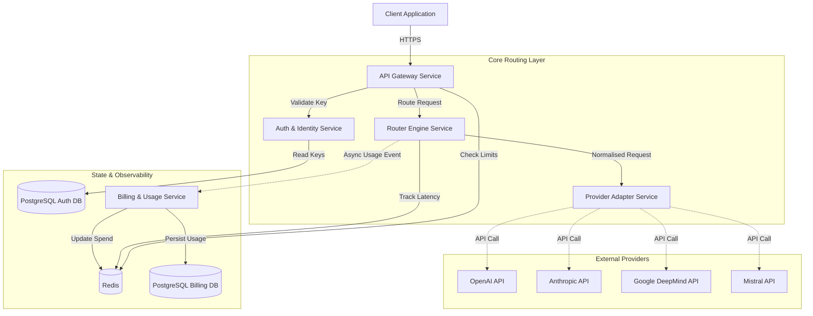

# 🚀 Comprehensive AI Routing Layer

An open/closed-source, production-grade AI routing platform that acts as a unified access layer for multiple large language model providers.

This system is a full AI infrastructure layer combining an LLM gateway, intelligent routing engine, usage control & billing system, and observability layer. It is built as a highly modular, independently deployable **microservice architecture** inspired by the Palantir architecture model.

**Author:** Farruh

---

## 📌 Architecture Overview

The system is composed of autonomous, "lego-style" microservices that can be scaled independently:

1. **API Gateway Service:** The unified entry point. Handles request validation, authentication, rate limiting, and monthly budget enforcement.
2. **Auth & Identity Service:** Internal service managing API keys, user tiers, and access policies.
3. **Router Engine Service:** The core intelligence layer. Executes static, dynamic (cost/latency), and policy-based routing strategies.
4. **Provider Adapter Service:** The abstraction layer that normalises inputs and outputs across OpenAI, Anthropic, Google, and Mistral, handling circuit breaking and retries.
5. **Billing & Usage Service:** Asynchronously processes usage events, calculates platform markup, and provides the Activity Logs API.

### Architecture Flow



---

## 🎯 Key Capabilities

* **Unified API:** A single OpenAI-compatible interface (`/v1/chat/completions`, `/v1/embeddings`).
* **Intelligent Routing:**
  * *Static:* Pre-configured fallback chains (e.g., `gpt-4o` → `claude-3-5-sonnet`).
  * *Dynamic:* Route to the lowest latency or lowest cost provider.
  * *Policy-based:* Filter providers based on Zero Data Retention (ZDR) requirements.
* **Cost Control:** True sliding-window rate limiting and hard monthly budget caps per API key.
* **Resilience:** Built-in circuit breakers and automatic retries per provider.
* **Prompt Caching:** Full pass-through support for Anthropic and OpenAI prompt caching to reduce costs.
* **Observability:** Complete Prometheus metrics, Grafana dashboards, and Loki log aggregation.

---

## 🧱 Tech Stack
* **Backend:** Python 3.11, FastAPI, Uvicorn, HTTPX
* **Data Layer:** PostgreSQL (asyncpg), Redis (hiredis), SQLAlchemy 2.0, Alembic
* **Observability:** Prometheus, Grafana, Loki, Promtail, structlog
* **Infrastructure:** Docker, Docker Compose, Kubernetes (Helm/Manifests)
* **Testing:** Pytest, HTTPX (tests are organised per microservice)

---

## 🚀 Getting Started

### Local Development (Docker Compose)

The easiest way to run the entire platform is via Docker Compose, which spins up all microservices, databases, and the observability stack.

1. **Configure environment variables:**
   ```bash
   cp .env.example .env
   # Edit .env to add your provider API keys
   ```

2. **Start the cluster:**
   ```bash
   docker compose up --build -d
   ```

3. **Access the services:**
   * API Gateway: `http://localhost:8000`
   * Gateway Swagger Docs: `http://localhost:8000/docs`
   * Grafana Dashboards: `http://localhost:3000` (admin/admin)
   * Prometheus: `http://localhost:9090`

### Creating an API Key

Because the Gateway requires an API key, you must create one using the admin endpoint:

```bash
curl -X POST http://localhost:8000/v1/keys \
  -H "X-Admin-Key: change-me-in-production" \
  -H "Content-Type: application/json" \
  -d '{
    "name": "Test Key",
    "tier": "pro",
    "monthly_budget_usd": 100.0
  }'
```

Save the `key` returned in the response (e.g., `sk-xyz...`).

### Making a Request

Use the key to make a standard OpenAI-compatible request:

```bash
curl -X POST http://localhost:8000/v1/chat/completions \
  -H "Authorization: Bearer sk-xyz..." \
  -H "Content-Type: application/json" \
  -d '{
    "model": "gpt-4o",
    "messages": [{"role": "user", "content": "Hello, world!"}]
  }'
```

---

## ⚙️ Configuration

Routing logic, pricing, and provider capabilities are controlled entirely via `ai/config/routing.yaml`. You can update this file and restart the Router service without modifying code.

---

## 🚢 Kubernetes Deployment

Production manifests are provided in the `infrastructure/k8s/` directory.

1. Generate secrets from the template:
   ```bash
   cp infrastructure/k8s/base/secrets.yaml.template infrastructure/k8s/base/secrets.yaml
   # Fill in the actual base64 encoded secrets
   ```

2. Apply the manifests:
   ```bash
   kubectl apply -f infrastructure/k8s/base/namespace.yaml
   kubectl apply -f infrastructure/k8s/base/secrets.yaml
   kubectl apply -f infrastructure/k8s/base/hpa.yaml
   kubectl apply -f infrastructure/k8s/services/
   ```
