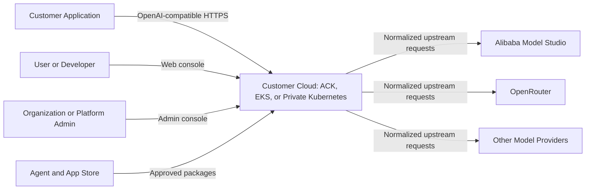
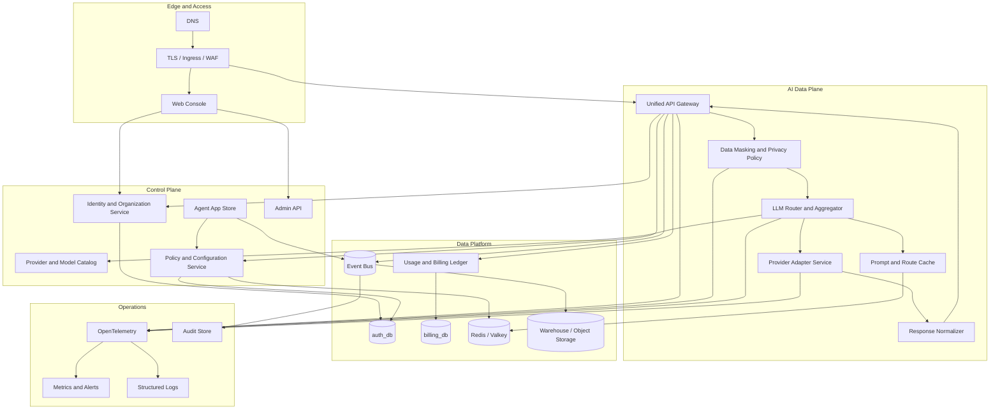
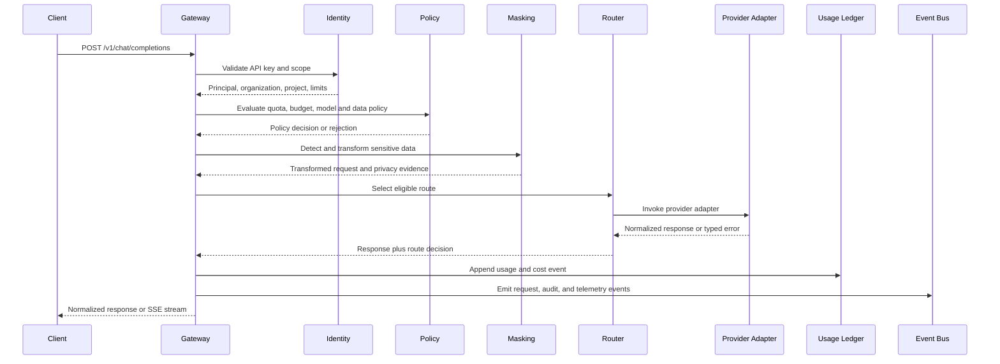
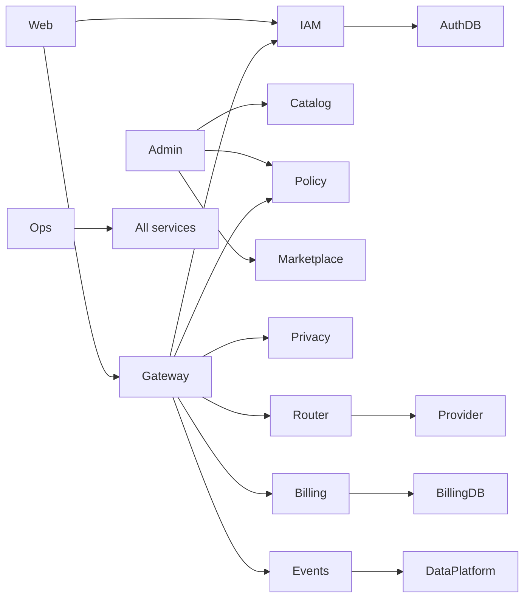
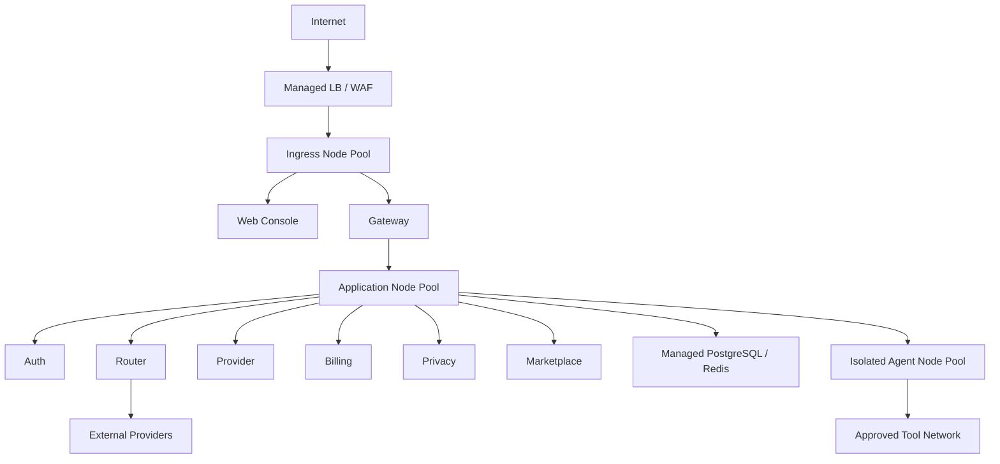

# Solvable System Architecture

**Author:** Farruh  
**Version:** 1.0  
**Status:** Engineering kickoff baseline

## 1. Architecture objective

Solvable is a customer-controlled AI control plane. The architecture must allow a client application to call one stable API while Solvable authenticates the caller, enforces organization and project policy, protects data, chooses an eligible model/provider, invokes the provider, normalizes the response, records usage and cost, and emits traceable operational events.

The architecture uses modular “lego” pieces: each service has a narrow responsibility, a clear contract, explicit state ownership, and a replaceable deployment unit. The current repository’s five services remain the first data-plane/control-plane core. New target capabilities are added as bounded modules and events rather than as cross-service shared database access.

## 2. Context diagram

## 3. Target logical architecture

## 4. Request lifecycle

## 5. Trust boundaries

| Boundary | Contents | Required control |
|---|---|---|
| Public edge | DNS, TLS, ingress, WAF, web console, API endpoint. | TLS, rate limiting, request-size limits, DDoS/WAF policy, secure headers, correlation IDs. |
| Authenticated control plane | User, organization, policy, billing, catalog, marketplace APIs. | Session/API-key authentication, RBAC, scope checks, MFA for privileged roles, audit. |
| AI data plane | Prompt, message, tool arguments, response, route decisions. | Preflight policy, masking, provider eligibility, no raw logging by default, deadlines. |
| Provider boundary | Upstream requests and provider credentials. | Adapter isolation, secret references, egress allowlist, provider policy, usage normalization. |
| Agent runtime | Third-party or customer-provided agents, tools, connectors. | Sandboxing, signed manifests, declared permissions, network and resource limits, approvals. |
| Data platform | Events, usage, audit, analytics, exports. | Schema validation, tenant filters, encryption, retention, immutable ledger, access review. |
| Operations plane | Metrics, traces, logs, alerts, deployment controls. | Masked telemetry, least privilege, separate access, audit, incident controls. |

## 6. Service ownership and dependency direction

The dependency direction is from edge to domain services to adapters and data stores. Services must not import another service’s private database models. Cross-domain facts are exchanged through versioned HTTP contracts or events.

## 7. Current implementation to target architecture

| Target capability | Current baseline | Implementation increment |
|---|---|---|
| Unified gateway | Gateway service with OpenAI-compatible routes, auth dependency, cache and policy helpers. | Formalize API contract, version errors, add organization/project context, expand contract tests. |
| Identity | Auth service, API keys, migrations, principal validation. | Add organizations, workspaces, roles, MFA, service identities, access reviews, and session controls. |
| Router | Router service, routing catalog, static mappings, fallback/latency logic, stream path. | Versioned policy engine, candidate filters, cost/quality scoring, circuit breakers, route simulation. |
| Provider | Provider service with adapter registry, OpenAI-compatible adapters, Model Studio runtime override. | Adapter SDK contract, capability registry, secret rotation, provider health, native adapters. |
| Billing | Billing service, usage/cost models, isolated billing database. | Append-only ledger, price versions, markup, credits, invoices, reconciliation, budgets and hard stops. |
| Privacy | Deterministic masking utility and request-local behavior exists in the implementation baseline. | Bounded privacy service/module, classification registry, policy management, tokenization store, retention and evidence. |
| Data platform | PostgreSQL, Redis, Prometheus/Grafana/Loki assets and request logging. | Event bus, versioned event schemas, sanitized warehouse exports, lineage, quality checks, analytics. |
| User/Admin panels | Dashboard and static artifact with overview, API keys, usage, Playground concepts. | Authenticated app shell, organization-aware User Panel and Admin Panel, route/policy/app-store workflows. |
| Agent app store | Not part of current five-service runtime. | Marketplace service, signed manifests, approval workflow, isolated runtime, tool and connector permissions. |
| Deployment | Docker Compose, Kustomize base, Alibaba and AWS overlays, live ACK pilot. | Reproducible image build, external secrets, multi-node production sizing, CI/CD, policy checks, disaster recovery. |

## 8. Deployment topology

### 8.1 Pilot

The approved pilot uses Alibaba ACK in Singapore, a small worker pool, ACR Personal Edition, internal PostgreSQL and Redis services, ingress-nginx, cert-manager, Alibaba-managed DNS, and Model Studio as one real provider. The pilot is suitable for functional validation, not a production availability guarantee.

### 8.2 Production reference

Production should use separate node pools for edge, stateless application services, data services, and agent runtime. PostgreSQL should be managed or deployed with a supported operator and tested backups. Redis/Valkey should have an explicit persistence and failover design. Provider credentials must be delivered through a cloud secret manager and synchronized through External Secrets or an equivalent mechanism. The ingress must use managed WAF or a validated edge security layer, TLS automation, private service networking, and controlled egress.

## 9. Architecture quality attributes

The architecture prioritizes tenant isolation, explainability, provider replaceability, low gateway overhead, bounded retries, deterministic cost control, auditable policy, safe extensibility, and deployment portability. It accepts the complexity of a modular platform in exchange for lower provider lock-in and stronger customer governance.

## 10. Architecture decisions that must remain explicit

The following are architecture decisions, not implementation details: database ownership remains segregated; raw prompts are not logged by default; provider keys remain externalized; route decisions are durable evidence; billing is append-only; app-store packages declare permissions; agents are isolated; and deployment overlays must not embed credentials. Any change requires an architecture decision record.
