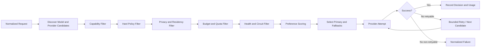

# Solvable LLM Router and Aggregator Specification

**Author:** Farruh  
**Version:** 1.0  
**Status:** Engineering kickoff baseline

## 1. Purpose

The router is the decision engine that converts a normalized AI request and caller context into an eligible provider/model attempt. It must separate hard policy constraints from optimization preferences. A preference may influence selection; it may never bypass a hard restriction.

## 2. Routing inputs

| Input | Examples | Source |
|---|---|---|
| Requested capability | chat, streaming, embeddings, structured output, tools, vision. | Request and model catalog |
| Requested model | `qwen-plus`, alias, route class, or auto. | Client |
| Principal context | Organization, workspace, project, user, key, role, plan. | Auth |
| Policy context | Model allowlist, provider allowlist, region, residency, data policy, budget, tier. | Policy service |
| Request metadata | Task type, priority, latency class, max cost, deadline, cache mode. | Client/project defaults |
| Provider state | Health, latency, error rate, rate-limit state, capacity, circuit state. | Router/observability |
| Cost state | Price version, credits, current period spend, remaining budget. | Billing |
| Privacy result | Classes detected, action, permitted provider classes, transformed fields. | Privacy module |
| Experiment context | Cohort, experiment ID, allocation, safety stop. | Policy service |

## 3. Candidate lifecycle



## 4. Hard filters

Hard filters execute before preference scoring:

1. The requested capability must be supported by the candidate model.
2. The model and provider must be enabled for the project and key.
3. The provider must be allowed by organization, data policy, residency, and compliance policy.
4. The candidate must fit the context, token, modality, and response constraints.
5. The candidate must fit the remaining rate, concurrency, quota, and budget limits.
6. The provider endpoint must not be in an open circuit state.
7. The candidate must satisfy app/agent declared provider and model restrictions.
8. The selected route must not violate a customer hard-stop or free-quota-only policy.

If no candidate remains, return a typed `NO_ELIGIBLE_ROUTE` error with safe reason categories and a route-decision record.

## 5. Preference scoring

The first implementation should use deterministic weighted scoring. A future adaptive scorer must be versioned and approval-gated.

```text
score(candidate) =
    w_cost     * normalized_cost_score(candidate)
  + w_latency  * normalized_latency_score(candidate)
  + w_quality  * normalized_quality_score(candidate)
  + w_health   * normalized_health_score(candidate)
  + w_capacity * normalized_capacity_score(candidate)
  + w_cache    * normalized_cache_score(candidate)
```

Weights come from a versioned route policy. Hard filters always execute first. Scores and component values are stored in the route-decision record for explainability.

## 6. Fallback and retry policy

A retry is allowed only when the error class is explicitly retryable, the request is within its deadline, the operation is safe to retry, and the retry budget remains. Streaming requests require special handling: once output has been sent, the platform must not restart the request against another provider unless the client and policy support continuation semantics.

| Failure | Default behavior |
|---|---|
| Connection timeout before upstream acceptance | Retry same candidate once, then next candidate. |
| Provider 429 | Respect retry-after when safe, then next candidate if deadline permits. |
| Provider 5xx before content | Retry with bounded backoff, then fallback. |
| Invalid request | Do not retry; normalize error. |
| Content/policy rejection | Do not bypass with fallback unless policy explicitly allows another eligible provider. |
| Authentication failure | Open provider health alert; do not retry repeatedly. |
| Stream failure before first chunk | Fallback may be allowed. |
| Stream failure after chunks | Return incomplete stream status; do not silently duplicate. |
| Budget exceeded | Stop immediately; no fallback can bypass the budget. |

## 7. Circuit breaker

Each provider endpoint has a state machine:

```text
CLOSED -> OPEN after threshold of failures
OPEN -> HALF_OPEN after cooldown
HALF_OPEN -> CLOSED after successful probes
HALF_OPEN -> OPEN after failed probe
```

State transitions are durable enough for audit and cached for fast routing. A circuit breaker must not hide a provider-wide incident from operations. The router should expose candidate exclusion reasons to authorized administrators.

## 8. Route policy example

```yaml
id: balanced-default
version: 3
hard:
  allowed_providers: [alibaba-model-studio, openrouter]
  allowed_regions: [ap-southeast-1]
  require_streaming: false
  max_estimated_cost_usd: 0.05
  require_zero_data_retention: false
preferences:
  cost: 0.35
  latency: 0.25
  quality: 0.25
  health: 0.15
fallback_chain:
  - model: qwen-plus
    provider: alibaba-model-studio
  - model: openai/gpt-4o-mini
    provider: openrouter
retry:
  max_attempts: 2
  deadline_ms: 30000
  retryable_errors: [timeout, upstream_5xx, rate_limit]
```

The configuration is an example only. Production values must come from the catalog and policy store, not hard-coded application constants.

## 9. Route-decision record

```json
{
  "route_decision_id": "rtd_01J...",
  "request_id": "req_01J...",
  "policy_id": "pol_01J...",
  "policy_version": 3,
  "requested_model": "auto",
  "candidates": [
    {"provider":"alibaba-model-studio","model":"qwen-plus","eligible":true,"score":0.87},
    {"provider":"openrouter","model":"openai/gpt-4o-mini","eligible":true,"score":0.82}
  ],
  "excluded": [
    {"provider":"provider-x","model":"model-y","reason":"region_not_allowed"}
  ],
  "selected": {"provider":"alibaba-model-studio","model":"qwen-plus"},
  "fallbacks": [{"provider":"openrouter","model":"openai/gpt-4o-mini"}],
  "retries": 0,
  "created_at": "2026-08-16T12:00:00Z"
}
```

## 10. Cache interaction

Prompt caching is optional and policy-controlled. Cache keys must include tenant, project, model, route-policy version, data-policy version, normalized messages, relevant generation parameters, and tool/schema versions. Sensitive or transformed requests must not be cached unless the policy explicitly permits it. Cache hits must still produce usage, cost, and audit metadata, with a clear cache status.

## 11. Quality routing

Quality signals may include offline evaluation scores, user feedback, structured-output validity, refusal rates, tool success, and task-specific benchmark results. Quality data must be versioned and cohort-aware. The router cannot infer “best quality” from a single noisy request. Any quality-based route must expose its evaluation version and safety stop.

## 12. Testing requirements

The router test suite must cover deterministic filtering, score ordering, static routes, fallback chains, retry budgets, deadlines, circuit transitions, budget hard stops, policy precedence, cache interaction, privacy constraints, provider health, streaming failure, and explainability fields. Contract tests must assert that no disallowed candidate is invoked.
