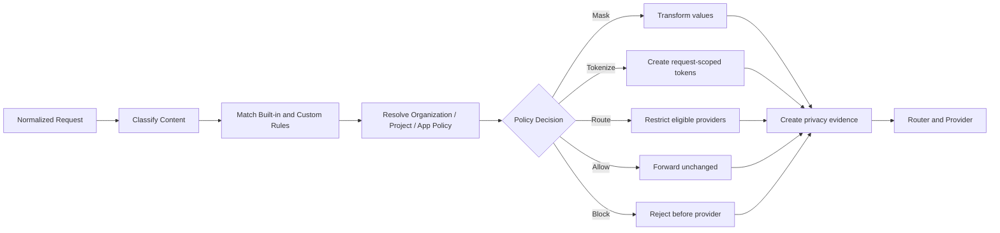

# Solvable Data Masking and Privacy Specification

**Author:** Farruh  
**Version:** 1.0  
**Status:** Engineering kickoff baseline

## 1. Purpose and boundary

The privacy layer protects prompts, messages, tool arguments, file metadata, responses, logs, traces, analytics events, and provider transmission. It must operate before the router invokes a provider and must provide a decision record that explains what happened without storing raw sensitive content by default.

Masking is a risk-reduction control, not a guarantee of perfect detection. Organizations must be able to choose conservative block or provider-restriction behavior for high-risk workloads.

## 2. Policy evaluation model



## 3. Classification taxonomy

| Class | Examples | Default action |
|---|---|---|
| `credential` | API keys, access keys, bearer tokens, private keys, passwords. | Block or redact. |
| `personal_contact` | Email, phone, address, contact records. | Mask in standard policy. |
| `financial` | Payment card, bank account, invoice, transaction details. | Mask or block by policy. |
| `government_id` | National identifiers, passport, driver license. | Block or tokenize. |
| `health` | Medical record, diagnosis, prescription, insurance information. | Restrict provider or block. |
| `confidential_business` | Contracts, customer records, internal strategy, source code. | Restrict provider; no raw logging. |
| `location` | Precise location, device coordinates, sensitive facility. | Mask or restrict. |
| `custom` | Organization-defined regex, dictionary, classifier, or structured field. | Organization-defined. |

## 4. Transformation actions

| Action | Behavior | Reversible? | Use case |
|---|---|---:|---|
| `allow` | Forward content unchanged under policy. | No | Low-risk content. |
| `log_only` | Forward content but record detection metadata without raw value. | No | Policy tuning. |
| `redact` | Replace value with `[REDACTED:<class>]`. | No | Highest safety. |
| `mask` | Preserve partial shape such as `jo***@example.com`. | No | Usability with reduced exposure. |
| `tokenize` | Replace with request-scoped opaque token. | Yes, if permitted | Workflows requiring restoration. |
| `hash` | Replace with keyed digest. | No | Matching without disclosure. |
| `block` | Reject request before upstream call. | No | Credentials or disallowed data. |
| `route_restrict` | Keep content but allow only approved provider class. | No | Residency or provider policy. |

## 5. Request-scoped tokenization

Tokenization is disabled by default. When enabled, the mapping must be:

- scoped to one request and tenant;
- stored only in protected memory or encrypted short-lived storage;
- assigned a TTL shorter than the request workflow lifetime;
- inaccessible to the provider and unrelated requests;
- unavailable to unauthorized log readers;
- deleted after restoration or expiry;
- excluded from analytics and error messages.

A token must not contain the original value, a reversible encoding, or a predictable sequence.

## 6. Policy precedence

The effective policy is resolved in this order:

1. Platform security hard stop.
2. Organization security and residency policy.
3. Workspace policy.
4. Project policy.
5. Application or agent policy.
6. API-key scope.
7. User preference.
8. Request-level option, only where the higher-level policy permits override.

A lower-level policy cannot weaken a higher-level `block`, provider restriction, retention limit, or budget hard stop.

## 7. Detection implementation

The first implementation should combine deterministic detectors and organization-defined rules. Detectors must return class, confidence, span, rule ID, detector version, and action candidate. A detector must never return the raw matched value in normal logs.

```json
{
  "classification": "credential",
  "confidence": 0.99,
  "span": {"start": 118, "end": 163},
  "rule_id": "builtin.access_key",
  "detector_version": "2026-08-01",
  "recommended_action": "block"
}
```

ML-assisted detectors may be added later, but their confidence threshold, false-positive behavior, model version, and fallback rule must be explicit. Security-critical credential patterns must remain deterministic.

## 8. Provider eligibility

The privacy decision can restrict providers by data-policy class. Provider catalog metadata must include a reviewed data policy, region, retention statement, contract status, and review date. If metadata is missing or expired, a high-security policy treats the provider as ineligible.

The platform must distinguish:

- data transformed before transmission;
- data transmitted unchanged;
- provider-retained data according to upstream terms;
- Solvable-retained data according to tenant policy;
- data intentionally omitted from telemetry.

## 9. Logging and telemetry rules

Logs and traces include class counts, rule IDs, action, policy version, and transformation count. They do not include raw matched values. Request bodies are not logged by default. Error messages must not echo the rejected input. Metrics use aggregated class labels and must avoid high-cardinality raw values.

## 10. Retention and deletion

Each tenant policy defines retention for raw content, transformed content, request metadata, privacy evidence, usage ledger, audit events, and exported files. Deletion jobs are idempotent and report completion. Legal hold, if supported, must be a separate explicit state with owner and expiration review.

## 11. Admin functions

The Admin Panel must support draft, test, review, activate, pause, version, rollback, and export for privacy policies. A test screen accepts fixtures and displays detected classes, transformations, provider eligibility, and expected route without calling a real provider. Test fixtures must be synthetic or approved sanitized examples.

## 12. Acceptance tests

| Test | Expected result |
|---|---|
| Access key in user prompt under high-security policy | Request blocked; provider receives nothing; audit event created without key value. |
| Email under standard masking policy | Email transformed; provider receives transformed value; response restoration follows policy. |
| Tokenization enabled | Mapping is request-scoped, expires, and cannot be accessed by another tenant. |
| Disallowed provider | Candidate removed before scoring; route decision records policy reason. |
| Raw logging disabled | Prompt and secret absent from logs, traces, metrics, events, and error body. |
| Custom rule update | Draft policy tests new rule; active version remains unchanged until approval. |
| Detector failure | High-security policy fails closed; low-risk policy applies configured fallback. |
| Retention expiry | Scheduled deletion removes content and leaves only permitted audit evidence. |

## 13. Security considerations

Treat prompts, responses, files, tool arguments, model outputs, and app manifests as untrusted content. Prompt injection must not change masking, routing, authorization, or tool permissions. A model output must never be trusted as a policy decision. The policy engine remains deterministic and server-side.
