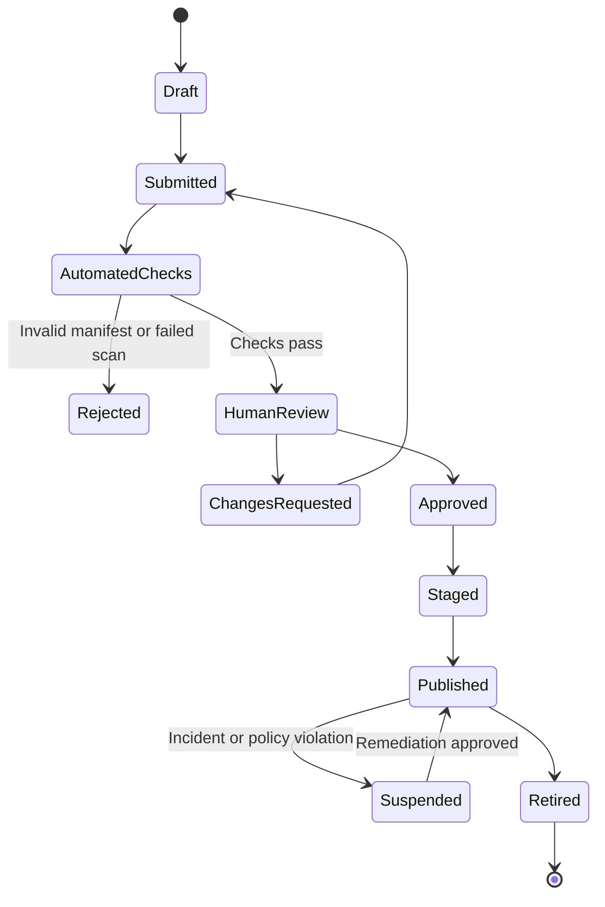
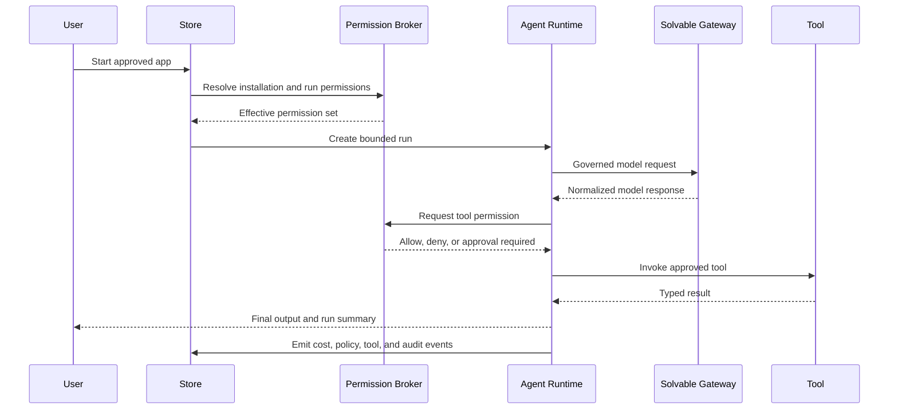

# Solvable Agent and Application Store Specification

**Author:** Farruh  
**Version:** 1.0  
**Status:** Engineering kickoff baseline

## 1. Purpose

The Agent App Store provides a governed way to discover, approve, install, operate, and remove agents, tools, connectors, workflows, prompt packs, and policy packs. It is not an unrestricted code marketplace. Every package must declare what it can access, what it can do, what it costs, where it sends data, and what side effects it may cause.

## 2. Package types

| Type | Runtime behavior | Examples |
|---|---|---|
| Agent | Model-driven workflow with instructions, tools, memory, and output contract. | Support triage, document analysis. |
| Tool | Discrete function with typed input/output and side-effect declaration. | Search, ticket creation, database lookup. |
| Connector | Authenticated external system integration. | CRM, ticketing, storage, messaging. |
| Workflow | Versioned graph of model, tool, condition, approval, and transform steps. | Document intake and approval. |
| Prompt pack | Versioned prompt templates and examples. | Customer-support style guide. |
| Policy pack | Reusable routing, masking, retention, or budget policy. | Strict PII policy. |

## 3. Signed package manifest

Every package includes a manifest similar to:

```yaml
apiVersion: solvable.ai/v1
kind: AgentPackage
metadata:
  id: app.document-review
  name: Document Review Agent
  version: 1.2.0
  publisher: pub_01J...
  description: Reviews approved documents and returns a structured summary.
  license: commercial
spec:
  type: agent
  entrypoint: run
  artifact:
    image: registry.example.com/apps/document-review@sha256:...
    signature: cosign-signature-ref
    sbom: sbom-ref
  compatibility:
    solvable_api: ">=1.0 <2.0"
    runtime: ">=0.5 <1.0"
  models:
    allowed:
      - qwen-plus
      - openai/gpt-4o-mini
  tools:
    required:
      - name: document.read
        scopes: [project.files.read]
      - name: export.write
        scopes: [project.exports.write]
  connectors: []
  data:
    reads: [document_content]
    writes: [summary]
    sends_external: false
    retention: request_policy
  network:
    egress: []
  side_effects:
    level: none
    approval_required: false
  resources:
    cpu_limit: "500m"
    memory_limit: "512Mi"
    timeout_seconds: 120
    max_concurrency: 2
  billing:
    pricing: pass_through_plus_markup
    max_run_cost: "0.05"
  security:
    declared_secrets: []
    risk_level: low
```

## 4. Publisher lifecycle

A publisher is verified before packages can be public or organization-wide. Verification includes identity, support contact, ownership, code/artifact provenance, license, security contact, and abuse process. Publisher status is visible in the catalog.

## 5. Review lifecycle



Automated checks include manifest schema validation, dependency scan, image scan, SBOM presence, signature verification, declared-network validation, secret scanning, permission-delta comparison, and known-vulnerability policy. Human review is required for medium/high-risk packages or packages with external side effects.

## 6. Installation flow

The organization owner or delegated approver sees the package manifest, publisher, version, data access, required permissions, provider/model restrictions, network destinations, maximum cost, side effects, security status, and retention behavior. Installation creates an explicit installation record bound to an organization, workspace, project, and version.

The installer must not grant permissions beyond organization policy. A package update is a new approval event if permissions, external destinations, model scopes, or side effects change.

## 7. Runtime isolation

The agent runtime is separate from the core API process. Minimum controls include:

- separate namespace or workload identity;
- non-root process and read-only filesystem where possible;
- CPU, memory, concurrency, execution-time, and output-size limits;
- egress allowlist and no unrestricted network by default;
- scoped model and provider access through Solvable gateway;
- tool invocation broker with schema validation;
- no direct provider keys exposed to the agent;
- ephemeral workspace with explicit file access;
- approval gates for high-impact actions;
- termination and cleanup after timeout or cancellation;
- complete run, tool, cost, and policy audit events.

## 8. Tool permission model

Permissions use resource-action-scope tuples:

```text
project.files.read
project.files.write
billing.usage.read
provider.model.invoke:qwen-plus
connector.crm.read
connector.crm.write
external.email.send
production.deploy.request
```

A permission is not effective unless it is declared in the manifest, approved by organization policy, granted at installation or run time, and validated by the permission broker.

## 9. Side-effect levels

| Level | Meaning | Approval default |
|---|---|---:|
| `none` | Read-only analysis or response generation. | No human approval. |
| `reversible` | Change can be undone within the platform. | Organization policy. |
| `external_communication` | Sends email, message, or webhook externally. | Yes by default. |
| `financial` | Purchases, charges, transfers, or billing changes. | Always human approval. |
| `destructive` | Deletes or irreversibly changes data/infrastructure. | Always human approval and explicit confirmation. |

## 10. App run lifecycle



## 11. Versioning and rollback

An installation pins an app version and manifest hash. A rollout may use staged percentages or organization cohorts. Rollback returns to the prior approved version and revokes newly introduced permissions if policy requires. If a package is suspended, new runs stop while in-flight runs are terminated according to risk.

## 12. Marketplace APIs

| Operation | Endpoint |
|---|---|
| Search catalog | `GET /api/v1/store/apps` |
| Read package | `GET /api/v1/store/apps/{id}/versions/{version}` |
| Install | `POST /api/v1/store/apps/{id}/install` |
| Approve installation | `POST /api/v1/store/installations/{id}/approve` |
| Start run | `POST /api/v1/store/installations/{id}/runs` |
| Stop run | `POST /api/v1/store/runs/{id}/cancel` |
| Roll back | `POST /api/v1/store/installations/{id}/rollback` |
| Publish package | `POST /api/v1/store/packages` |
| Submit review | `POST /api/v1/store/apps/{id}/reviews` |
| Report abuse | `POST /api/v1/store/apps/{id}/reports` |

## 13. Acceptance tests

A package cannot be installed when its signature is invalid, permissions exceed organization policy, required model is disabled, artifact digest differs from manifest, vulnerability policy fails, or declared network destinations are not approved. A runtime test must prove the agent cannot access a tool that is absent from its effective permission set and cannot exceed its budget or resource limit.
