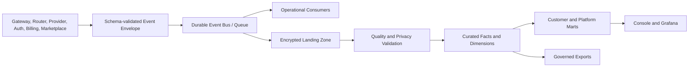

# Solvable Data Platform Specification

**Author:** Farruh  
**Version:** 1.0  
**Status:** Engineering kickoff baseline

## 1. Purpose

The data platform turns governed operational events into trustworthy product analytics, cost intelligence, reliability evidence, and customer exports. It must preserve tenant isolation and privacy by design. The platform is not a second source of truth for identity or billing; it is a derived, lineage-aware analytical system.

## 2. Data zones

| Zone | Purpose | Typical retention | Raw sensitive content |
|---|---|---:|---:|
| Operational store | Current transactional state for APIs. | Domain-defined. | No by default. |
| Event log | Append-only domain events and audit evidence. | Longest operational evidence. | Masked metadata only. |
| Landing zone | Immutable encrypted event/file ingestion. | Short staging period. | Only policy-approved payloads. |
| Curated warehouse | Conformed facts/dimensions for analytics. | Contract-defined. | No raw prompts by default. |
| Serving marts | Pre-aggregated dashboards and customer usage views. | Shorter. | Aggregated only. |
| Export zone | Customer/admin export files with expiry. | Short and explicit. | Policy-approved fields only. |

## 3. Ingestion architecture



The current deployment may use a managed queue or a database-backed outbox while volume is low. The outbox pattern is preferred for reliable publication: a transaction writes domain state and an event record atomically, then a publisher delivers the event with retry and idempotency.

## 4. Event ingestion requirements

Every event has an event ID, type, schema version, producer, timestamp, request and tenant context, classification, trace context, and payload. Producers must use an outbox or equivalent delivery guarantee. Consumers checkpoint offsets and deduplicate by event ID.

Invalid events enter a quarantine stream with validation error, producer, schema, and first-seen time. Quarantine data is access-restricted and expires according to policy. A replay tool must require an operator, reason, target consumer, and bounded range.

## 5. Operational stores

PostgreSQL stores transactional domain state and small read models. Redis/Valkey stores counters and short-lived state. Object storage stores encrypted exports, reports, artifact metadata, and optionally policy-approved content. The warehouse stores conformed analytical data.

No analytical workload should run unbounded queries against the gateway or billing primary database. Read replicas or export pipelines protect production APIs.

## 6. Canonical facts and dimensions

### Facts

| Fact | Grain |
|---|---|
| `fact_ai_request` | One accepted request. |
| `fact_provider_attempt` | One provider/model attempt. |
| `fact_token_usage` | One normalized usage observation. |
| `fact_billing_ledger` | One immutable financial event. |
| `fact_route_decision` | One route decision with candidate result. |
| `fact_privacy_decision` | One privacy evaluation. |
| `fact_agent_run` | One app/agent execution. |
| `fact_tool_call` | One permissioned tool invocation. |
| `fact_incident_signal` | One observable alert or health transition. |

### Dimensions

`dim_time`, `dim_organization`, `dim_workspace`, `dim_project`, `dim_model`, `dim_provider`, `dim_route_policy`, `dim_privacy_policy`, `dim_app`, `dim_environment`, and `dim_region` are versioned where business meaning can change.

## 7. Lineage

Every curated metric must identify source event types, transformation version, execution timestamp, tenant scope, and quality status. A dashboard card should be traceable to a mart query, the mart to curated facts, the facts to event IDs, and the event IDs to originating service request IDs.

```text
Dashboard -> Mart Query -> Curated Fact -> Event ID -> Service Request -> Policy and Route Evidence
```

Lineage metadata is stored alongside pipeline definitions. A release that changes a metric definition must create a metric version and changelog.

## 8. Data quality checks

| Check | Example |
|---|---|
| Completeness | Every completed request has organization, project, request ID, status, and timestamp. |
| Validity | Provider/model IDs and currencies exist in the catalog. |
| Uniqueness | Ledger event IDs and event IDs are unique. |
| Referential integrity | Project belongs to organization; key belongs to project. |
| Timeliness | Completed usage reaches billing within the target window. |
| Consistency | Total tokens equal input plus output minus documented adjustments. |
| Privacy | Raw prompt and secret patterns are absent from curated payloads. |
| Reconciliation | Provider-reported usage matches internal estimates within tolerance. |
| Freshness | Dashboard marts update within their stated SLA. |

Quality failures create alerts and data-quality incidents. They do not silently coerce invalid values into zero.

## 9. Analytics products

Customer analytics includes usage, latency, success rate, cache savings, provider/model mix, route decisions, budget status, and exportable cost detail. Platform analytics includes aggregate traffic, provider reliability, SLOs, route efficiency, free-quota consumption, marketplace adoption, and security signals. Tenant data is filtered at query time and, where possible, physically partitioned or row-level secured.

## 10. Exports

Exports are asynchronous jobs with requested fields, filters, requester, purpose, format, retention, and row count. Files are encrypted, access-controlled, signed with short expiry, and deleted after retention. A large export must not block an API request. Exported data includes a schema version and generated-at timestamp.

## 11. Retention defaults

The platform default is metadata-only request logging with no raw prompt/response retention. Usage and billing records follow financial retention requirements. Audit events follow security retention. Temporary caches, token maps, quarantine records, and exports have shorter TTLs. An organization may choose a shorter retention period, subject to ledger and audit minimums.

## 12. Backfills and reprocessing

Backfills are versioned jobs with source range, target tables, expected row counts, checkpoint, owner, idempotency behavior, and rollback strategy. Reprocessing events must not create duplicate billing charges; consumers use event IDs and ledger idempotency keys.

## 13. Cost and capacity controls

The data platform enforces partitioning, retention deletion, query limits, warehouse quotas, export caps, and cost alerts. High-cardinality labels such as request ID, prompt text, or arbitrary metadata are prohibited in metrics. Raw events are compressed and partitioned by event date and tenant-safe dimensions.

## 14. Acceptance criteria

The platform must ingest a completed request event, derive usage and route facts, populate customer and platform dashboards, preserve lineage to the request ID, reject a malformed event into quarantine, prevent cross-tenant query leakage, replay a bounded event range idempotently, reconcile a billing adjustment without mutating history, and delete an expired export on schedule.
