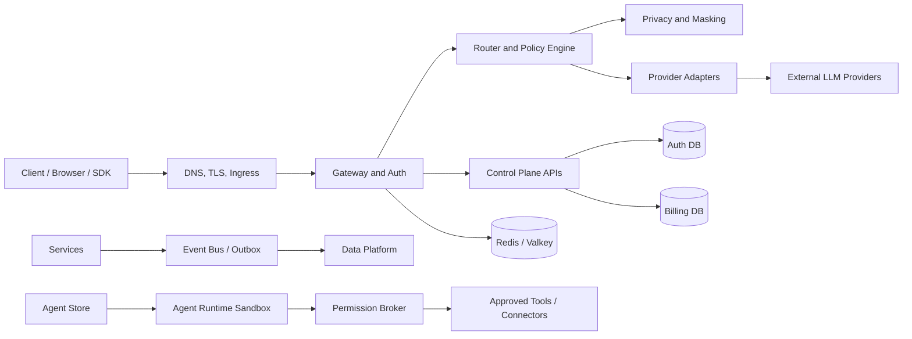

# Solvable Security Threat Model

**Author:** Farruh  
**Version:** 1.0  
**Status:** Engineering kickoff baseline

## 1. Security objectives

Solvable must protect tenant isolation, credentials, provider keys, financial records, audit evidence, availability, model-request confidentiality, and the integrity of routing and policy decisions. It must make unsafe behavior observable and recoverable without treating model output as trusted control-plane input.

This model is grounded in the [OWASP Application Security Verification Standard][1], [OWASP Top 10 for LLM Applications][2], [NIST Digital Identity Guidelines][3], [Kubernetes security guidance][4], and OpenTelemetry semantic conventions.[5]

## 2. Trust boundaries

Boundary-specific controls include TLS and request validation at the edge, authentication and rate limiting at the gateway, deterministic policy and privacy evaluation in the core, provider secret isolation in adapters, tenant-scoped database access, signed event envelopes, and sandboxed agent execution.

## 3. STRIDE analysis

| Boundary/component | Threats | Controls |
|---|---|---|
| Client to edge | Spoofing, tampering, replay, flooding. | TLS, secure sessions, request IDs, idempotency, WAF/rate limits, body limits. |
| Edge to gateway | Header spoofing, path confusion, SSRF. | Trusted proxy headers, strict routing, URL validation, network policy. |
| Gateway to auth | Token theft, privilege escalation, stale revocation. | Hashed keys, scope checks, revocation events, short cache TTL, audit. |
| Gateway to router | Policy bypass, tampered context, replay. | Authenticated internal calls, signed/context-bound metadata, server-owned policy context. |
| Router to provider | Secret leakage, unauthorized provider, cost abuse. | Secret manager, allowlists, budgets, adapter isolation, egress policy, circuit breaker. |
| Service to database | Injection, cross-tenant access, exfiltration. | Parameterized queries, least-privilege roles, tenant predicates, migrations, encryption. |
| Event bus to analytics | Poison events, leakage, duplication. | Schema validation, masking, outbox, idempotent consumers, quarantine, lineage. |
| Store to agent runtime | Malicious package, escape, data exfiltration. | Signatures, scans, sandbox, no privileged containers, egress allowlist, resource caps. |
| Runtime to tools | Unauthorized side effect, confused deputy. | Permission broker, typed schemas, approval gates, scoped tokens, audit. |
| Admin console | Privilege abuse, CSRF, secret disclosure. | MFA, secure cookies, reauth, RBAC, CSRF protection, one-time secrets, audit. |

## 4. OWASP LLM risk controls

| Risk | Solvable control |
|---|---|
| Prompt injection | Treat model text as untrusted; isolate system policy; validate tool arguments; never allow model output to change RBAC, masking, billing, or routing. |
| Insecure output handling | Schema validation, output encoding, content limits, safe rendering, tool result validation. |
| Training data poisoning | Provider governance, model catalog review, evaluation evidence, model version tracking. |
| Model denial of service | Body/token/concurrency/time limits, budgets, queue backpressure, circuit breakers. |
| Supply chain vulnerabilities | Signed images/packages, SBOM, dependency scanning, provenance, review. |
| Sensitive information disclosure | No raw logs by default, masking, provider eligibility, retention controls, secret scanning. |
| Insecure plugin design | Manifest permissions, typed tools, sandbox, egress allowlist, approval. |
| Excessive agency | Side-effect levels, human approval, least privilege, execution limits. |
| Overreliance | Confidence/quality metadata, validation, human review for high-impact actions. |
| Model theft or abuse | Access control, quotas, anomaly detection, output restrictions where required. |

## 5. Abuse cases

The security test plan must include stolen API key use, cross-tenant object access, privilege escalation through role or project IDs, prompt injection asking an agent to exfiltrate data, malicious app manifest requesting hidden network access, tool argument smuggling, provider key exposure in logs, budget bypass via retries, billing double-charge, replayed webhook/event, path traversal in exports, SSRF through provider URLs, and denial of service through long streams.

## 6. Secret management

Secrets live in a cloud secret manager or approved Kubernetes secret integration. Plaintext secrets are never committed, printed, returned from APIs, embedded in images, or stored in browser bundles. Rotation is tested, not merely documented. A compromised provider key can be disabled independently from application credentials.

Required controls include secret owner, environment scope, rotation interval, last-use tracking, emergency revoke, dual approval for high-impact keys, and automated scanning of repository, CI logs, container layers, and exports.

## 7. Agent and connector threats

Agents are untrusted application code and model orchestration. They cannot receive provider secrets, access the Kubernetes API, run privileged containers, mount host paths, reach arbitrary internet destinations, or invoke unapproved tools. Connector credentials are brokered and scoped. External side effects require declared manifest permissions and runtime approval.

Prompt injection from a document, webpage, email, tool result, or model output must not override the permission broker. Tool responses are treated as untrusted data and validated before being included in a subsequent model context.

## 8. Supply-chain security

All service and app images have a digest, SBOM, scan result, provenance, and signature. Dependencies are pinned or constrained, critical vulnerabilities have an owner and remediation target, and base images are refreshed. CI runners do not receive production secrets. Release artifacts are promoted rather than rebuilt without evidence.

## 9. Security gates

A release is blocked when secret scanning finds a live-looking credential, a critical vulnerability exceeds policy, an image is unsigned, a manifest requests privileged access without approval, a public ingress exposes a restricted service, a migration lacks backup evidence, contract tests fail, or a tenant-isolation test fails.

## 10. Break-glass access

Break-glass is limited to approved security or platform administrators, requires MFA and a reason, expires automatically, exposes the minimum resource, and produces an immutable audit event. Raw content access is never a default support capability.

## 11. Incident response

Security incidents follow containment, evidence preservation, eradication, recovery, and lessons learned. Immediate actions may include revoking keys, disabling a provider or app, freezing a project budget, blocking an IP or route, isolating a workload, or pausing marketplace installs. Customer notification and regulatory assessment are handled by the organization’s approved process.

## 12. References

[1]: https://owasp.org/www-project-application-security-verification-standard/ "OWASP Application Security Verification Standard"
[2]: https://owasp.org/www-project-top-10-for-large-language-model-applications/ "OWASP Top 10 for Large Language Model Applications"
[3]: https://pages.nist.gov/800-63-4/ "NIST Digital Identity Guidelines"
[4]: https://kubernetes.io/docs/concepts/security/ "Kubernetes Security"
[5]: https://opentelemetry.io/docs/concepts/semantic-conventions/ "OpenTelemetry Semantic Conventions"
