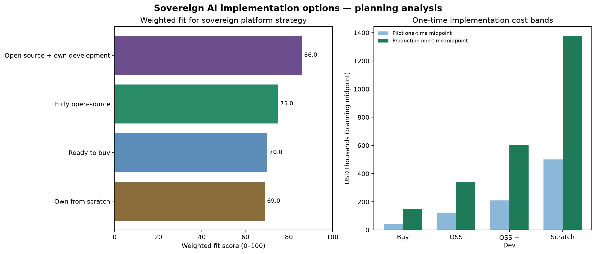

# Sovereign AI Platform: Four Implementation Options

## Procurement and engineering decision memo

**Prepared for:** Farruh

**Date:** August 11, 2026

> **Legal and procurement disclaimer.** I am an AI, not a lawyer or procurement adviser. The Uzbek regulatory interpretation and cost figures below are a technical planning analysis, not a formal legal opinion, tender price, or vendor quote. Qualified Uzbek counsel, the relevant cybersecurity and banking authorities, and shortlisted suppliers should validate the final deployment and procurement package.

## Executive recommendation

Use a **two-speed strategy**:

1. **Buy or partner for the pilot.** Deploy a commercially supported or locally operated gateway to prove demand, onboarding, user experience, model catalog, masking workflows, and basic billing within approximately one to three months. Use low-risk, synthetic, public, or explicitly approved data at this stage. UzCloud is a locally relevant candidate because its public product page advertises Uzbek-market AI gateway functionality, local data masking, audit, and an option for deployment inside a customer data center [14]. A local pilot partner can reduce integration and procurement friction, but its technical claims still require independent testing.

2. **Build the strategic sovereign core on open-source foundations.** The recommended long-term path is **open-source plus proprietary development**. Keep the gateway, routing, provider adapters, policy engine, masking vault, tenant controls, billing, audit, RAG authorization, and agent/tool broker under the project’s control. Reuse mature components such as LiteLLM or Portkey Gateway patterns, Presidio, Keycloak, vLLM, Qdrant/pgvector, MinIO/Ceph, Kubernetes, and OpenTelemetry, while writing the Uzbekistan-specific privacy, policy, billing, multilingual detection, and assurance layer internally [7] [8] [9] [10] [11] [12].

3. **Do not build everything from scratch first.** A ground-up implementation is justified only after the platform has proven its policy model, workloads, traffic patterns, and procurement demand. It should be reserved for components where strategic independence is genuinely valuable—such as the privacy decision engine, Uzbek/Russian entity recognizers, secure mapping vault, national policy registry, or a central-government control plane—not for reimplementing every mature gateway, telemetry, database, or inference primitive.

## 1. What is being compared

The four paths differ in what the organization purchases and what it must own operationally.

| Path | What is purchased | What the organization owns | Best initial use |
| --- | --- | --- | --- |
| **Ready to buy** | A managed gateway, commercial AI platform, local provider, or private deployment package | Configuration, contracts, tenant data, and selected integration code | Rapid pilot and lower-risk workloads. |
| **Fully open-source** | No core software license; infrastructure, support, and integration services | Deployment, configuration, security hardening, upgrades, and operations | Organizations with a strong platform/MLOps team and a preference for maximum software independence. |
| **Open-source + own development** | Open-source building blocks plus engineering services and proprietary modules | Sovereign control plane, policy, masking, billing, domain logic, and product roadmap | Recommended strategic path for government and banking. |
| **Own solution from scratch** | Infrastructure, engineering, security, and perhaps selected commercial components | Every gateway, adapter, policy, data, agent, observability, and lifecycle component | Long-term national utility or highly differentiated platform after requirements are proven. |

The comparison uses seven decision dimensions: sovereignty and residency control, time to pilot, feature coverage, cost predictability, Uzbekistan-specific customization, operational risk, and vendor independence. The weights reflect a regulated government and banking platform: sovereignty is weighted most heavily, followed by time to pilot, customization, and feature coverage. The resulting score is a decision aid, not an objective market ranking.

*Figure 1. Weighted fit and one-time implementation cost midpoint. The score is a planning model; cost bars are not vendor quotes and exclude variable model usage.*

## 2. Summary decision matrix

| Dimension | Ready to buy | Fully open-source | Open-source + own development | Own from scratch |
| --- | ---: | ---: | ---: | ---: |
| Sovereignty and residency control | 3/5 | 5/5 | 5/5 | 5/5 |
| Time to pilot | 5/5 | 3/5 | 4/5 | 2/5 |
| Feature coverage | 5/5 | 3/5 | 4/5 | 3/5 |
| Cost predictability | 3/5 | 3/5 | 3/5 | 1/5 |
| Customization for Uzbekistan | 3/5 | 4/5 | 5/5 | 5/5 |
| Operational risk | 4/5 | 2/5 | 3/5 | 1/5 |
| Vendor independence | 1/5 | 5/5 | 5/5 | 5/5 |
| **Weighted fit score** | **70/100** | **75/100** | **86/100** | **69/100** |

The score favors **open-source plus own development** because it combines sovereignty and independence with a faster path than a ground-up system. Ready-to-buy ranks strongly on speed and existing features, but loses on vendor independence and the difficulty of proving that an external control plane is acceptable for restricted data. Fully open-source avoids license dependence but transfers operational risk to the buyer. Ground-up build provides maximum theoretical control but has the slowest delivery, highest execution risk, and least cost predictability.

## 3. Cost model and assumptions

The following bands are planning ranges for a regulated pilot and an initial production baseline. They assume one government or state-enterprise tenant, one bank tenant, a small-to-medium user population, a gateway, masking, RAG, basic agents, audit, quotas, two or more model adapters, and at least one domestic inference path. They exclude large-scale model training, national data-center construction, taxes and customs, formal certification fees, 24/7 SOC outsourcing, and high-volume external model-token charges.

| Cost component | Included in the bands | Excluded or separately quoted |
| --- | --- | --- |
| One-time implementation | Architecture, integration, tenant setup, policy configuration, security hardening, initial testing, deployment automation, and documentation | Large data migration, model pre-training, national benchmark creation, formal certification, and extensive custom application development. |
| Monthly fixed cost | Platform operations, SRE/DevOps, support, monitoring, backup, ordinary compute/storage, patching, and basic security operations | High-end GPU purchases, major colocation expansion, 24/7 SOC, and premium enterprise support. |
| Variable cost | External provider calls, local GPU utilization, image/audio/video processing, OCR at scale, and data egress where permitted | These must be modeled using real traffic and provider contracts. |
| Domestic GPU and infrastructure CAPEX | **Separate planning envelope: approximately $200,000–$1,500,000** for a meaningful self-hosted footprint, depending on model size, redundancy, GPU class, networking, storage, data-center readiness, and DR | This is an engineering estimate, not a quote. Hardware import, customs, power/cooling, and support can materially change it. |

For managed products, official pages demonstrate that platform charges can vary from a development tier to enterprise-scale gateways. Azure’s published API Management v2 pricing lists approximately $150.01/month for Basic v2, $700/month for Standard v2, and $2,801/month for Premium v2; the same page says prices are estimates and that AI Gateway tier pricing is still forthcoming [22]. AWS separately charges model inference and Bedrock Guardrails filter units; its current pricing page lists, for example, $0.15 per 1,000 text units for content filters, $0.10 for sensitive-information filters, $0.10 for contextual-grounding checks, and $0.17 for automated-reasoning checks [23]. Portkey’s public pricing page shows plan-level log allowances and enterprise features such as private-cloud/VPC deployment, but exact enterprise subscription pricing is quote-based [24]. These figures demonstrate cost structure rather than a final Uzbek purchase price.

### 3.1 Cost bands by path

| Path | Pilot one-time implementation | Pilot monthly fixed cost | Initial production implementation | Production monthly fixed cost | Pilot time | Main cost uncertainty |
| --- | ---: | ---: | ---: | ---: | --- | --- |
| **Ready to buy** | $10,000–$75,000 | $2,000–$15,000 | $50,000–$250,000 | $8,000–$35,000 | 1–3 months | Enterprise licensing, private deployment, local support, integration, and provider usage. |
| **Fully open-source** | $60,000–$180,000 | $8,000–$30,000 | $180,000–$500,000 | $20,000–$70,000 | 3–6 months | Engineering availability, patching, security hardening, and infrastructure scale. |
| **Open-source + own development** | $120,000–$300,000 | $12,000–$40,000 | $300,000–$900,000 | $30,000–$100,000 | 4–8 months | Uzbek-language recognizer quality, policy scope, product staffing, and assurance requirements. |
| **Own from scratch** | $350,000–$650,000 | $20,000–$60,000 | $750,000–$2,000,000 | $50,000–$180,000 | 9–15 months | Scope expansion, connector maintenance, security defects, hiring, and certification delays. |

These ranges intentionally include operational engineering rather than only software licensing. A “free” open-source license does not mean a free sovereign platform: a bank still pays for identity, HSM/KMS, GPU capacity, redundancy, support, testing, incident response, patching, and people who can operate it.

## 4. Option A — ready to buy

### What it looks like

The organization contracts a commercial or local provider and deploys the platform using its existing gateway, model catalog, guardrails, dashboard, and support. Candidates include Microsoft’s AI gateway capabilities, AWS Bedrock Guardrails, Google managed AI platforms, Portkey, Alibaba Cloud Smart Studio, NodeShift, and local Uzbek offerings such as UzCloud. Microsoft documents multi-provider and self-hosted endpoint management, unified model API capabilities, authentication, token quotas, content safety, semantic caching, load balancing, and telemetry in Azure API Management [16]. Portkey documents universal API routing, fallbacks, retries, circuit breakers, multimodality, custom hosts, budget limits, and self-hosting [17].

For a government or bank, “ready to buy” should mean **ready to deploy inside an approved boundary**, not merely “sign up for a SaaS API.” The contract must state where prompts, responses, logs, mappings, embeddings, images, and backups are processed; whether the provider trains on them; who owns keys; how administrators are controlled; and how the service can be exported or replaced.

### Advantages and disadvantages

| Advantages | Disadvantages |
| --- | --- |
| Fastest route to a working pilot. | External control planes may be unacceptable for restricted workloads. |
| Mature provider adapters, dashboards, retries, quotas, and support. | Vendor lock-in in APIs, policy formats, logs, pricing, and identity. |
| Lower initial engineering risk. | PII masking and safety controls are usually probabilistic and provider-specific. |
| Easier to obtain support and service-level commitments. | Private/on-premises features may be enterprise-only or quote-based. |
| Useful for proving business value before a large build. | Model, token, gateway, guardrail, storage, and egress charges can compound. |

### When to choose it

Choose this path when the first objective is a short pilot, the data is public, synthetic, or explicitly approved for external processing, and the buyer values support and time-to-market over maximum independence. A local provider or a private deployment is preferable to a foreign SaaS control plane for government and banking. For Tier 1 data, the ready-to-buy platform should be used only if it can be deployed in the client’s controlled environment and independently passes data-flow, key-custody, tenant-isolation, and masking tests.

## 5. Option B — fully open-source

### What it looks like

The buyer assembles the platform from open-source components. A plausible stack is LiteLLM or Portkey Gateway for provider abstraction and routing, Envoy or Kong for edge control, Keycloak for identity, Presidio and custom recognizers for PII, NeMo Guardrails or Guardrails AI for policy and structured-output controls, Llama Guard for safety classification, vLLM or TGI for local inference, Qdrant or pgvector for retrieval, MinIO or Ceph for objects, Kubernetes for orchestration, and OpenTelemetry for observability. LiteLLM documents provider abstraction, load balancing, retries, cooldowns, and fallback routing [7]. Presidio documents detection, anonymization, and extensibility but warns that automated detection cannot find all sensitive information [8].

### Advantages and disadvantages

| Advantages | Disadvantages |
| --- | --- |
| Zero or low core software licensing cost. | No single vendor owns end-to-end reliability. |
| Full deployment control, including air-gapped operation. | Integration complexity can create a fragile chain of gateways and guardrails. |
| Source visibility and easier policy customization. | The buyer owns patching, CVE response, upgrades, connector changes, and incident response. |
| Avoids dependence on one commercial gateway. | Uzbek/Russian detection, banking rules, billing, and agent governance still require development. |
| Strong fit for local data and model hosting. | Total cost moves from licenses to engineering and infrastructure. |

### When to choose it

Choose it when the buyer already has a strong security, platform, MLOps, and SRE organization and can accept a longer pilot. It is suitable for a technology foundation, but not necessarily as a finished product. Fully open-source is the best low-license-cost path, not automatically the lowest total-cost path.

## 6. Option C — open-source with own development

### What it looks like

This path uses open-source components for commodity infrastructure and writes proprietary modules where sovereignty, domain policy, and product differentiation matter. The proprietary layer should include the policy registry, classification model, local data schemas, masking and restoration rules, encrypted mapping vault, Uzbek Latin/Cyrillic and Russian recognizers, tenant isolation, billing, routing policy, RAG authorization, agent/tool capability broker, approval workflow, audit evidence, and a control-plane API.

The provider adapters should remain replaceable. The gateway and policy contracts should be owned by the project. The platform may support LiteLLM or Portkey initially, but the project should keep an adapter interface that allows the dependency to be replaced without changing client applications. This is consistent with the project principle that an adapter is an isolated, replaceable, testable unit.

### Advantages and disadvantages

| Advantages | Disadvantages |
| --- | --- |
| Best balance of sovereignty, speed, customization, and independence. | Requires a durable engineering team rather than a one-time implementation vendor. |
| Uzbek-specific masking, policy, billing, and regulatory evidence become proprietary assets. | The organization remains responsible for upstream open-source vulnerabilities. |
| Reuses mature routing, inference, storage, identity, and telemetry components. | Integrating and testing the components requires senior architecture and security capability. |
| Can support local-only, hybrid, and approved external models behind one contract. | Some commercial support or indemnification may still be needed. |
| Creates a product that can be offered to ministries, banks, and enterprises. | Initial requirements must be controlled to avoid building an oversized platform. |

### When to choose it

This is the recommended path for the project. It allows a rapid pilot using a local or commercial implementation partner while preserving a strategic migration to a sovereign core. The first proprietary modules should be the ones that protect the platform’s trust boundary—not a new vector database, new Kubernetes distribution, or new generic API gateway.

## 7. Option D — own solution from scratch

### What it looks like

The organization builds a new gateway, router, provider adapter framework, privacy engine, RAG system, agent runtime, image and multimodal pipeline, billing system, observability layer, control plane, and deployment platform with minimal dependence on existing AI-gateway software.

### Advantages and disadvantages

| Advantages | Disadvantages |
| --- | --- |
| Maximum architectural independence. | Longest delivery and highest probability of scope expansion. |
| Full control over protocol, policy, data model, and security evidence. | Must reproduce years of ecosystem work: provider quirks, streaming, retries, quotas, model metadata, and edge cases. |
| Can be optimized for Uzbek government and banking workflows. | More proprietary code means more security review, maintenance, and staff dependency. |
| Easier to make the central platform a national utility. | Higher opportunity cost than using mature components. |
| Strongest ownership of long-term product IP. | Hardest route to prove production reliability quickly. |

### When to choose it

Choose this path only when the platform becomes national critical infrastructure, the core requirements are stable, the budget can support a multi-year engineering organization, and there is a clear reason existing components cannot meet the required security or sovereignty boundary. Even then, a ground-up build should selectively reuse standards and infrastructure primitives rather than reimplementing cryptography, Kubernetes, telemetry, or databases.

## 8. Product-by-product recommendation

Different customers can receive different procurement packages even when they use the same underlying platform.

| Customer | Recommended procurement | Why |
| --- | --- | --- |
| Ministry or agency with immediate need | Ready-to-buy/local partner pilot, then migrate to OSS + own development | Demonstrates value quickly while preserving an exit path. Use synthetic/public data first. |
| Central government or security-sensitive agency | OSS + own development with domestic inference and a dedicated control plane | Requires sovereign keys, local audit, restricted egress, and policy ownership. |
| Commercial bank | OSS + own development deployed in bank perimeter, optionally supported by a commercial vendor | Bank secrecy, tenant isolation, HSM/KMS, audit, RAG ACLs, and approval workflows are bank-specific. |
| SME or startup | Ready-to-buy local gateway or shared enterprise edition | Lower entry cost and faster adoption; use low-risk data policy. |
| National AI platform operator | OSS + own development as the baseline; selective ground-up modules | A shared utility needs independence, but should not duplicate mature infrastructure unnecessarily. |
| Research laboratory or university | Fully open-source | Maximizes experimentation and data/control ownership with lower licensing cost. |

## 9. Recommended contracting and exit requirements

Every option should be procured with an exit plan. The buyer should require export of tenant configuration, routing policies, model catalog metadata, usage records, audit events, RAG metadata, prompt templates, evaluation results, and application definitions in documented formats. Provider adapters should be replaceable, and client applications should use the project’s normalized API rather than a vendor-specific schema.

The contract should define data processing, retention, model training exclusion, sub-processors, geographic processing locations, breach notification, administrator access, support response, key ownership, log ownership, deletion evidence, backup deletion, vulnerability disclosure, source-code escrow where appropriate, and the right to conduct technical audits. Vendor claims such as “fully compliant,” “zero leakage,” or “100% anonymous” should be treated as marketing statements until supported by test results, contracts, architecture evidence, and independent assessment.

## 10. Final decision

For the Uzbek government and banking market, the most credible strategy is:

> **Buy speed; own the trust boundary; build the sovereign differentiation.**

Use a ready-to-buy or local-partner solution for a constrained pilot. At the same time, build the open-source-plus-proprietary control plane that will eventually own identity, policy, privacy, routing decisions, mapping keys, audit, RAG authorization, agent approvals, and billing. Keep external model access optional and policy-gated. Only move toward a ground-up core where pilot evidence shows that mature open-source components cannot meet the national requirements.

The practical sequence is therefore **Ready-to-buy pilot → OSS foundation → proprietary sovereign control plane → selective ground-up components**. This sequence provides the fastest path to customer evidence without surrendering long-term sovereignty or product ownership.

## References

[1]: <https://lex.uz/docs/4396428> “Law of the Republic of Uzbekistan No. ZRU-547, On Personal Data,” LexUZ.

[2]: <https://lex.uz/mact/41882> “Law of the Republic of Uzbekistan No. 530-II, On Bank Secrecy,” LexUZ.

[3]: <https://lex.uz/en/docs/7159258> “Strategy for the Development of Artificial Intelligence Technologies until 2030,” LexUZ.

[4]: <https://lex.uz/en/docs/6997403> “Law of the Republic of Uzbekistan No. LRU-764, On Cybersecurity,” LexUZ.

[5]: <https://csrc.nist.gov/pubs/sp/800/207/final> “SP 800-207, Zero Trust Architecture,” NIST.

[6]: <https://csrc.nist.gov/pubs/sp/800/226/final> “SP 800-226, Guidelines for Evaluating Differential Privacy Guarantees,” NIST.

[7]: <https://docs.litellm.ai/docs/routing> “Router – Load Balancing,” LiteLLM documentation.

[8]: <https://presidio.dataprivacystack.org/> “Presidio,” Microsoft/Data Privacy Stack documentation.

[9]: <https://docs.vllm.ai/en/latest/> “vLLM Documentation,” vLLM project.

[10]: <https://qdrant.tech/documentation/> “Qdrant Documentation,” Qdrant.

[11]: <https://www.keycloak.org/documentation> “Keycloak Documentation,” Keycloak project.

[12]: <https://opentelemetry.io/docs/> “OpenTelemetry Documentation,” OpenTelemetry project.

[13]: <https://www.alibabacloud.com/en/solutions/smart-studio?_p_lc=1> “Smart Studio,” Alibaba Cloud.

[14]: <https://uzcloud.uz/en/corporate/ai-gateway> “Corporate AI Gateway in Uzbekistan,” UzCloud, public product page.

[15]: <https://nodeshift.com/> “NodeShift – Your Private AI Platform,” public product page.

[16]: <https://learn.microsoft.com/en-us/azure/api-management/genai-gateway-capabilities> “AI gateway capabilities in Azure API Management,” Microsoft Learn.

[17]: <https://portkey.ai/docs/product/ai-gateway> “AI Gateway,” Portkey documentation.

[18]: <https://docs.aws.amazon.com/bedrock/latest/userguide/guardrails.html> “Amazon Bedrock Guardrails,” AWS documentation.

[19]: <https://docs.nvidia.com/nemo/guardrails/about-nemo-guardrails-library/overview.html> “NeMo Guardrails,” NVIDIA documentation.

[20]: <https://guardrailsai.com/> “Guardrails AI,” official documentation.

[21]: <https://huggingface.co/meta-llama/Llama-Guard-3-8B> “Llama Guard 3,” Meta model card.

[22]: <https://azure.microsoft.com/en-us/pricing/details/api-management/> “API Management pricing,” Microsoft Azure.

[23]: <https://aws.amazon.com/bedrock/pricing/> “Amazon Bedrock pricing,” AWS.

[24]: <https://portkey.ai/pricing> “Portkey pricing,” Portkey.
