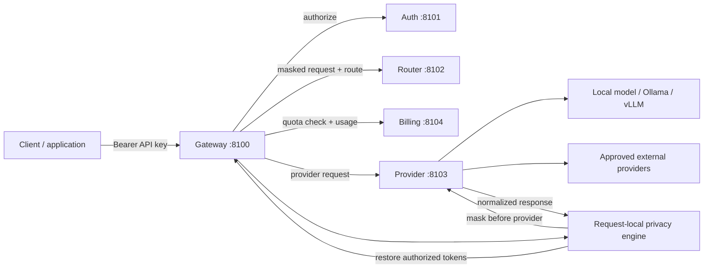
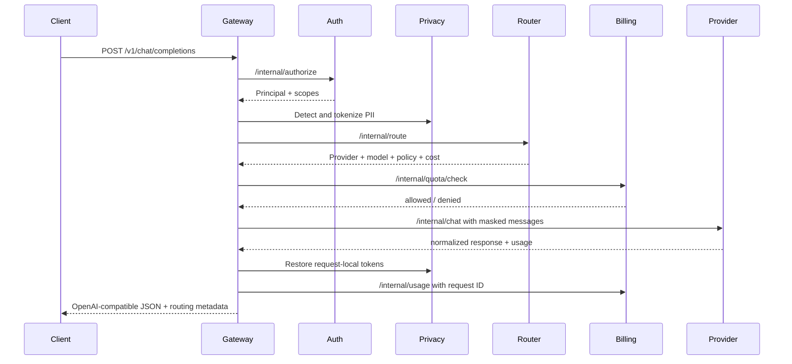

# AI Routing Layer — Standalone Microservices Reference

**Author:** Farruh

## Purpose

This reference implements a small but working version of the AI Routing Layer as five independently runnable FastAPI services. The public gateway is the only client-facing service. It authenticates the caller, masks sensitive values, asks the router for a policy decision, checks quota, calls the provider service, restores authorized values in the response, and records usage in billing.

The reference is intentionally self-contained. It uses in-memory stores and deterministic fake providers so that the entire integration can be tested without external API keys, GPUs, PostgreSQL, or Redis. The service boundaries and REST contracts are designed so those local implementations can later be replaced by production adapters.

## Service map

| Service | Port | Responsibility | Persistent boundary in production |
| --- | ---: | --- | --- |
| `gateway` | 8100 | Public OpenAI-compatible API, request IDs, privacy boundary, orchestration, response normalization | Stateless; logs and traces only through redacted telemetry. |
| `auth` | 8101 | API-key validation, principal and organization resolution, scope enforcement | `auth_db` with hashed keys, organizations, roles, scopes, and revocation state. |
| `router` | 8102 | Model allowlist, local/external residency policy, fallback chain, cost metadata | Policy registry backed by versioned configuration database. |
| `provider` | 8103 | Provider adapter boundary, normalized provider response, token/latency measurement | Adapter configuration, health state, circuit breakers, and provider credentials in a secret manager. |
| `billing` | 8104 | Quota preflight, idempotent usage ledger, monthly spend and alerts | `billing_db` with append-only usage and invoice records; Redis may cache counters only. |

The services communicate through HTTP REST and a shared internal secret in the reference. Production should replace the shared secret with mTLS plus workload identity and short-lived service credentials.

## Architecture



The reference gateway currently keeps the privacy mapping inside one request. For production, replace that component with the sovereign privacy fabric described in the main project report: deterministic detection, encrypted mapping vault, tenant-scoped keys, classification policy, redaction and tokenization modes, image/OCR scanning, and auditable restoration.

## Request workflow



## REST contracts

### Public gateway

`POST /v1/chat/completions` accepts an OpenAI-style body with `model`, `messages`, `temperature`, `max_tokens`, `stream`, and `metadata`. The client must send `Authorization: Bearer sk-local-demo` in the reference.

The reference intentionally rejects `stream=true` with HTTP 400 because SSE requires a separate streaming contract and usage-finalization path. The response preserves the provider’s Chat Completions shape and adds an `x_routing` object containing the request ID, selected provider/model, route reason, fallback chain, masked entity count, latency, and usage-recording status.

`GET /v1/models` returns the local and approved external model catalog. `GET /health` reports process health. `GET /ready` checks all four internal dependencies and returns a readiness aggregate.

### Internal contracts

| Caller | Endpoint | Purpose |
| --- | --- | --- |
| Gateway → Auth | `POST /internal/authorize` | Convert API key plus required scope into a principal. |
| Gateway → Router | `POST /internal/route` | Select provider/model under residency, tier, allowlist, fallback, and cost rules. |
| Gateway → Billing | `POST /internal/quota/check` | Reject a request whose estimated cost would exceed the organization budget. |
| Gateway → Provider | `POST /internal/chat` | Execute a masked request through the selected adapter. |
| Gateway → Billing | `POST /internal/usage` | Record actual usage and cost idempotently by `request_id`. |

Every internal call requires `X-Internal-Secret`. Every internal service returns a structured FastAPI error when the credential or payload is invalid.

## Routing policy

The reference policy is in `ai/config/routing.json`, not hard-coded into the router logic. `local` routes to the local fake provider and is permitted without external approval. `gpt-4o-mini` represents an approved external route but is rejected unless the caller sets `metadata.allow_external=true` and has a non-free tier. The router also returns a fallback chain, although the reference gateway does not yet execute provider failover; the production router should treat fallback as a state machine with health checks, circuit breakers, and residency re-evaluation at every hop.

## Privacy behavior

The gateway masks the following deterministic patterns in the reference: email addresses, fourteen-digit PINFL-like values, sixteen-digit card-like values, Uzbek passport-like values, Uzbekistan phone-like values, and secret assignments such as `api_key=...`. The mapper creates request-local tokens such as `<EMAIL_1>` and restores them only in the provider response returned for that request.

This is not a complete privacy solution. Regexes can miss names, addresses, health information, source-code secrets, image text, documents, and context-dependent identifiers. Production must combine custom Uzbek Latin/Cyrillic and Russian recognizers, NER, OCR, checksum validators, secret scanners, classification policy, confidence thresholds, false-negative tests, and fail-closed routing for restricted data.

## Failure semantics

| Failure | Gateway behavior in reference | Production behavior |
| --- | --- | --- |
| Missing/invalid API key | HTTP 401 | Same, with key revocation and organization policy lookup. |
| Missing scope | HTTP 403 | Same, with RBAC/ABAC and policy decision logging. |
| External route not approved | HTTP 403 | Same, plus data-classification evidence and no raw egress. |
| Quota exceeded | HTTP 429 | Same, with atomic budget reservation and alerting. |
| Internal service unavailable | HTTP 502/503 | Retry only idempotent calls; use circuit breakers and an outbox for usage. |
| Provider error | HTTP 502 | Retry according to provider policy, then evaluate fallback chain under residency rules. |
| Streaming request | HTTP 400 | Implement SSE with terminal usage event and cancellation accounting. |
| Billing write failure | Gateway request fails rather than silently losing usage | Use a durable usage outbox and reconcile asynchronously. |

## Local deployment

The reference supports two local execution modes.

```bash
python3 -m venv .venv
source .venv/bin/activate
python -m pip install -r requirements.txt
PYTHONPATH=. python scripts/e2e_smoke.py
```

For a long-running local stack:

```bash
PYTHONPATH=. python scripts/run_local.py --provider-mode fake
```

For Docker Compose:

```bash
docker compose up --build
curl http://localhost:8100/ready
```

The deterministic fake provider is the default and is what the automated tests exercise. The provider service has an optional `PROVIDER_MODE=ollama` path for a local Ollama adapter when the route’s provider is `local-ollama` and an Ollama model is running.

## Production migration map

| Reference implementation | Production replacement |
| --- | --- |
| In-memory `KEYS` | Hashed API-key records, role assignments, organizations, revocation, and audit in `auth_db`. |
| In-memory billing totals | Append-only PostgreSQL usage ledger in `billing_db`, idempotency key on `request_id`, and Redis counters for fast preflight. |
| Shared internal secret | mTLS, SPIFFE/workload identity, secret manager, and network policy. |
| Regex-only privacy | Privacy fabric with NER, OCR, secret scanning, custom Uzbek/Russian recognizers, encrypted vault, and policy registry. |
| Fake provider | Isolated adapters for Ollama/vLLM, OpenAI-compatible providers, Anthropic, Google, Mistral, image, embedding, and multimodal APIs. |
| Process-local config | Versioned policy service with approvals, rollback, tenant overrides, and audit. |
| Single process per service | Containers, Kubernetes deployments, HPA, PDB, readiness probes, mTLS, centralized redacted telemetry, and multi-site DR. |
| No streaming | SSE contract with backpressure, cancellation, terminal usage event, and partial-output policy. |

## Known gaps

The reference is working software for contract and integration validation, not a production deployment. It does not yet include PostgreSQL migrations, Redis rate limiting, API-key hashing, mTLS, encrypted persistent mappings, multi-tenant isolation, model quality evaluation, prompt-injection defenses, RAG ACL filtering, agent tool authorization, image redaction, SSE streaming, real external provider calls, Kubernetes manifests, or formal compliance evidence. Those are deliberate next increments rather than hidden claims of completeness.
