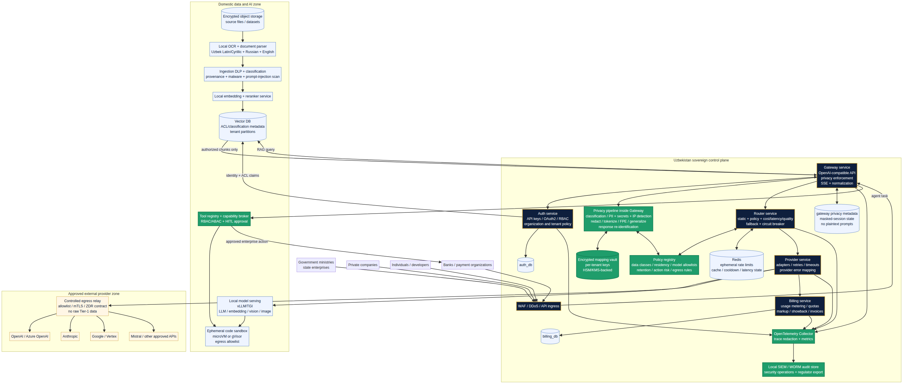
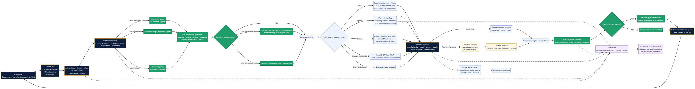

# Sovereign AI Masking and Routing Platform for Uzbekistan

## Technical and General Blueprint for Government, Banks, Enterprises, and Individuals

**Prepared for:** Farruh

**Project context:** One API → many LLM providers

**Status:** Research and solution blueprint; regulatory and security review required before production or procurement

> **Legal disclaimer.** I am an AI, not a lawyer. This report is a working technical and policy analysis, not formal legal advice. Uzbekistan-qualified counsel, the relevant data-protection authority, the Central Bank, and cybersecurity authorities should validate the final processing model, contracts, classifications, and cross-border routing rules before reliance or deployment.

## Executive conclusion

The strongest product opportunity is not another generic LLM proxy. It is a **sovereign AI control plane**: a locally governed platform that gives ministries, banks, state-owned enterprises, private companies, and individuals one API and one operating environment for many models, while keeping identity, policy, sensitive-data transformation, retrieval permissions, keys, audit evidence, and high-risk agent actions under Uzbek-controlled governance.

The platform should combine four product surfaces. The first is a **Unified AI Gateway** with an OpenAI-compatible baseline for chat, embeddings, images, streaming, and tool calls. The second is a **Privacy and Sovereignty Fabric** that classifies data, detects PII and secrets, applies redaction or reversible tokenization, and enforces local-only or approved-egress decisions. The third is an **AI Studio and App Store** that lets ministries and companies deploy governed RAG assistants, coding workspaces, document intelligence, multimodal applications, and agents. The fourth is a **Control and Assurance Plane** for tenants, quotas, cost, audit, evaluation, model risk, and incident response.

The essential design principle is **fail closed for restricted data**. Masking should reduce exposure, but it should never be presented as proof that any external provider is legally or technically unable to infer, retain, log, or reconstruct information. Where the data class is government-restricted, bank-secret, biometric, genetic, or otherwise high impact, the default route should be a domestic model or a dedicated in-country confidential workload. External providers should be an explicitly governed option for lower-risk, appropriately transformed data, subject to current Uzbek law, approved destinations, contractual terms, provider retention settings, technical verification, and client policy.

Uzbekistan’s official AI strategy creates a strong policy fit: it identifies banking and finance, healthcare, digital government, agriculture, energy, education, culture, and tourism as priority sectors, and calls for AI infrastructure, data processing capacity, research laboratories, data security, and skills development through 2030 [3]. The current personal-data text must, however, be represented accurately. The official LexUZ page, including the 2026 amendment, no longer supports a simplistic claim that every category of Uzbek personal data must always remain on servers physically inside Uzbekistan. It specifically requires domestic storage for biometric data, genetic data, and telecom-user data, while allowing other personal data to be stored and processed abroad under specified adequacy, contractual, corporate-rule, or approved-international-standard conditions [1]. A sovereign architecture remains the most defensible default for government and banking workloads, but legal claims must be tied to the actual data category and current rule.

## 1. What the platform is

The proposed product can be described as a **Sovereign AI Gateway and Studio**. It is the Uzbek-controlled mediation layer between users and AI providers. A ministry, bank, or company connects once to the platform; the platform authenticates the tenant, determines the data and action risk, applies privacy policies, chooses a permitted model, translates the request into the provider’s protocol, observes the response, restores only authorized tokens where appropriate, and returns one normalized response shape.

The platform should expose the following baseline interfaces:

| Interface | Purpose | Sovereignty requirement |
| --- | --- | --- |
| `/v1/chat/completions` and streaming SSE | OpenAI-compatible conversational and agentic workloads | The gateway must classify every request before provider selection; raw restricted content stays local. |
| `/v1/embeddings` | Local or approved embedding generation for RAG and search | Restricted documents and embeddings should be processed in the domestic data zone. |
| `/v1/images` | Image generation, transformation, and redaction | Image metadata, faces, plates, OCR text, and sensitive source images require local inspection. |
| `/v1/responses` or a normalized equivalent | Structured responses, tool calls, reasoning-capable workflows | Tool execution must be separate from model output and governed by capabilities. |
| `/v1/agents` and `/v1/tools` | Governed agent plans and enterprise actions | High-impact actions require explicit authorization and human approval. |
| Admin and audit APIs | Tenants, policies, models, usage, incident evidence, evaluations | Administrative access is tenant-scoped, logged, and protected by strong identity controls. |

This model is broader than a proxy because it owns the **policy decision**. A generic gateway can translate provider schemas and retry calls, but the sovereign platform must decide whether a request may leave the country, whether it must be irreversibly redacted, whether a retrieved document is allowed in the context window, and whether a model-generated tool call may perform a consequential action.

## 2. Why masking is central, and why masking alone is insufficient

In this context, masking means transforming sensitive content before it is passed to a model or another processing boundary. The transformation may be irreversible, such as deletion, redaction, generalization, or suppression, or reversible within a controlled session, such as pseudonyms or tokens that are restored only after the response has passed policy checks.

| Technique | Example | Reversible | Best use | Main limitation |
| --- | --- | ---: | --- | --- |
| Redaction | `Passport number: [REDACTED]` | No | External low-trust prompts; analytics; broad summaries | Can remove information needed for reasoning. |
| Type-preserving placeholder | `<PERSON_01>`, `<ACCOUNT_01>` | Yes, through a local vault | Customer service, document drafting, case analysis | The model can still infer relationships and may leak placeholders. |
| Deterministic pseudonym | `Client_A`, `Branch_12` | Yes, within a tenant/session | Multi-turn tasks requiring referential consistency | A compromised mapping vault deanonymizes the data. |
| Vault tokenization | `tok_uz_7F...` | Yes, policy-controlled | Banking workflows and structured records | Requires key separation, access control, retention, and revocation. |
| Format-preserving encryption | Numeric or alphabetic identifier with the same shape | Yes, with keys | Legacy schemas, controlled structured identifiers | It is not a full privacy solution; domain size and key management matter. NIST SP 800-38G specifies FF1 and FF3 for format-preserving encryption [18]. |
| Generalization | Exact age → age band; exact amount → range | Usually no | Analytics and model evaluation | Lower utility and possible residual re-identification. |
| Synthetic data | Artificial customer or transaction records | No, if properly generated | Development, testing, partner sandboxes | Synthetic data does not automatically provide a formal privacy guarantee. |
| Local-only processing | No external transformation | Not applicable | State secrets, bank-secret records, biometric/genetic data, sensitive source code | Higher domestic compute and operations cost. |

A platform-wide privacy decision must cover more than obvious PII. It should detect and classify personal identifiers, PINFL and passport formats, taxpayer identifiers, bank accounts and cards, health data, biometric references, secrets and credentials, source code and proprietary IP, legal privilege, government classifications, customer identifiers, location data, and prompts that contain instructions to exfiltrate data. Presidio is a useful baseline because it supports custom and predefined recognizers using NER, regular expressions, rules, checksums, context, image OCR, and structured-data modules; its own documentation warns that automated detection cannot find all sensitive information and must be supplemented by other controls [10].

The right privacy architecture is therefore **defense in depth**. Detection should combine deterministic patterns, multilingual NER, checksum validation, contextual classification, secret scanners, file and image inspection, policy thresholds, and adversarial tests. The policy engine should be able to return four outcomes: allow local, allow masked external, require human approval, or block. When detection confidence is low but the potential impact is high, the outcome should be local-only or block, not permissive routing.

## 3. Uzbek regulatory and sovereignty interpretation

The report is designed for regulated deployment, but the architecture must not convert vendor marketing language into legal conclusions. Uzbekistan’s Personal Data Law defines personal data broadly and includes collection, storage, use, provision, transfer, depersonalization, and destruction within processing [1]. The current Article 27-1 text on the official LexUZ page requires domestic storage for biometric and genetic data and for data of telecom-service users; it also states conditions under which other personal data may be stored and processed abroad. Cross-border transfer is separately defined and tied to adequate protection, consent or other statutory grounds, and possible restrictions for national security and citizens’ rights [1].

Bank secrecy is a separate control domain. The official Bank Secrecy Law covers client transactions, accounts, deposits, information obtained in connection with banking services, certain client assets, and related interbank information. It defines disclosure broadly, while allowing limited provision to third parties such as legal, accounting, audit, information, and consulting service providers when necessary and when confidentiality obligations apply [2]. The law also requires banks to adopt organizational and technical measures, including information-security and cybersecurity measures, to protect bank-secret information [2]. A routing platform should therefore be procured and operated as a tightly controlled service provider with contractual confidentiality, tenant isolation, restricted administrative access, local audit, and clear data-flow documentation. The law is not a blanket authorization to send bank-secret content to any foreign model API.

Uzbekistan’s Cybersecurity Law identifies the State Security Service as the authorized state body in cybersecurity and describes critical-infrastructure registration, cybersecurity requirements, certification and attestation, incident investigation, inspections, and obligations to follow authorized instructions [4]. The final architecture should be capable of producing security architecture documentation, asset inventories, data-flow diagrams, control evidence, incident records, and model/provider inventories for the client’s sectoral review. This does not mean that every deployment is automatically critical information infrastructure; classification must be determined by the competent authorities and applicable sector rules.

The official AI strategy is a strong strategic fit rather than a compliance waiver. It sets national targets and identifies finance, healthcare, digital government, agriculture, energy, education, culture, and tourism as priority sectors, while calling for AI infrastructure, high-performance computing, data processing capacity, data security, and human-resource development [3]. The proposed platform can serve as the shared operational layer for those projects while keeping high-sensitivity data and keys under domestic control.

## 4. High-level architecture



*Figure 1. Recommended separation of the Uzbek sovereign control plane, domestic data and AI zone, and approved external-provider zone. The design preserves the project’s five independent services: gateway, auth, router, provider, and billing.*

### 4.1 Five-service control plane

The architecture follows the project’s existing engineering guidance. The system is divided into five independent microservices that communicate through HTTP REST: **gateway**, **auth**, **router**, **provider**, and **billing**. Shared domain models, exceptions, and middleware belong in the shared library. Auth and billing retain isolated PostgreSQL databases, and Redis is used only for ephemeral state such as rate limits, prompt-cache entries, cooldowns, latency state, and spend caches—not as the persistent system of record.

| Service | Core responsibility | Must not own |
| --- | --- | --- |
| Gateway | OpenAI-compatible ingress, request validation, streaming, privacy pipeline, response normalization, request correlation | Provider-specific business rules or billing ledger tables. |
| Auth | API keys, OAuth2/OIDC integration, users, organizations, roles, tenant policy bindings, service identities | Billing data or provider secrets in application tables. |
| Router | Model catalog, policy routing, cost/latency/quality scoring, health, fallback chains, circuit breakers, routing decisions | Raw prompts or tenant PII. |
| Provider | Isolated adapters, provider schema translation, retries, timeouts, token normalization, unified errors | Cross-tenant policy decisions. |
| Billing | Usage events, token and provider-cost attribution, quotas, markup, alerts, invoices, showback | Raw prompt content unless a client explicitly and lawfully retains it. |

The privacy pipeline should remain part of the Gateway service in the first implementation so that no unmasked request can bypass it through a separate internal hop. Its state store should hold only the minimum masked-session metadata and encrypted mappings required for the workflow. The vault keys must be separated from the mapping data and protected by a domestic HSM or an approved key-management service. Raw prompts and full responses should not be placed in ordinary application logs.

### 4.2 Policy decision model

Every request should receive a policy context before model selection. The context includes tenant, user, role, purpose, source application, data class, geographic and legal constraints, model capability, provider contract, cost ceiling, latency target, and action risk. The router then selects from a **permitted model set**, not from the global model catalog.

| Policy dimension | Example decision |
| --- | --- |
| Data classification | Tier 1 bank-secret or state-restricted data → local-only model; Tier 3 public text → approved external models may be considered. |
| Residency | Biometric/genetic or telecom-user data → domestic processing and storage by default; other categories → check current transfer and contract conditions. |
| Tenant | Bank A’s prompts and RAG corpus cannot be routed to Bank B’s models, caches, or vector partitions. |
| Model capability | Vision, image, embedding, code, tool use, JSON schema, and long context are capability constraints, not just model names. |
| Cost | Enforce per-key, per-team, per-model, and per-organization budget caps before dispatch. |
| Latency | Use health and recent latency windows, but never sacrifice residency or risk policy for speed. |
| Quality | Use task-specific evaluation scores and fallback equivalence; do not assume that a cheaper model is interchangeable. |
| Action risk | Drafting may be automatic; sending a message, changing a record, approving a payment, or publishing a state document requires approval. |

The router should record a signed or tamper-evident decision event containing the policy version, model allowlist, selected provider, fallback candidates, reason codes, and the identity of the decisioning service. This makes a later compliance review possible without retaining plaintext prompts in every observability system.

## 5. End-to-end workflow



*Figure 2. Request workflow for chat, RAG, agentic AI, coding, image generation, and multimodal workloads.*

A request first enters through WAF and API ingress, is authenticated, and is associated with a tenant and user context. The Gateway parses the request into a canonical internal representation and applies size, schema, file, content-type, and abuse controls. A data-classification stage then inspects text, images, files, conversation history, tool arguments, and retrieved context.

The classifier produces a risk decision. Restricted data is pinned to local inference. Internal data may be masked and sent only to explicitly approved external providers if the client’s policy and current legal basis permit it. Public or low-risk data can use the broader provider catalog, but still passes standard prompt-injection, secret, content, and output controls. If the classifier is uncertain and the impact is high, the request is escalated to local-only processing or blocked.

For reversible workflows, the masking engine replaces entities with deterministic per-request or per-session tokens and writes the mapping to an encrypted vault. The external model sees the sanitized prompt. The response is then validated for schema, content, secrets, prompt-injection artifacts, and token integrity. Only after authorization and validation does the Gateway restore original values. Restoration must be constrained by tenant, user, purpose, session, token type, and output destination. For irreversible workloads, the system does not retain a mapping and returns a de-identified answer.

The platform should use separate paths for retrieval, agent actions, coding, and image generation. This is safer than treating all content as plain text. RAG has ingestion, embedding, vector, retrieval, and prompt-assembly risks. Agentic workloads add tool and side-effect risks. Coding workloads contain secrets and proprietary IP whose meaning may be damaged by blind masking. Images contain EXIF, faces, license plates, OCR text, and visual identifiers that require local inspection. Every path should still converge on the same policy, routing, audit, and normalization controls.

## 6. Workload blueprints

### 6.1 Privacy-preserving RAG and document intelligence

The RAG plane should be domestic by default for government and bank tenants. Files enter encrypted object storage and pass malware scanning, file-type validation, hashing, provenance capture, OCR, and document classification. The ingestion system should record who uploaded the file, when, from which source, under which approval, and what classification was assigned.

OCR and parsing should support Uzbek Latin, Uzbek Cyrillic, Russian, and English. Sensitive entities should be detected before embedding. The vector record should carry tenant, owner, document ID, classification, allowed roles, retention, purpose, and source hash. Chunking must avoid separating security labels or access-control boundaries from the content they protect. Retrieval must enforce authorization before results enter the model context; filtering unauthorized chunks after retrieval is too late because the restricted text has already reached the application and may be logged or passed to the model.

OWASP’s RAG guidance recommends document hashing, provenance, scans for hidden instructions and invisible Unicode, trusted-source allowlists, approval workflows for new sources, access-control metadata on every chunk, retrieval-time authorization, tenant isolation, and retrieval logging [9]. The platform should implement these controls as a first-class ingestion and retrieval policy rather than relying only on a vector database’s default settings.

For external model usage, the safest pattern is to send only a minimum authorized context assembled from local retrieval. If a document is Tier 1, the answer should be generated locally. If a lower-risk document can be processed externally, the context should be transformed, the provider’s retention and training terms should be documented, and the request should carry a policy reason code. Embeddings and vector indexes should not be assumed to be harmless: they can reveal semantic information, so they remain tenant-controlled data.

### 6.2 Agentic AI

The agent plane should treat the model as a planner, not as an authority. A request is converted into an explicit plan whose steps are checked against a tool registry. Each tool has a name, purpose, tenant scope, resource scope, read/write permissions, input schema, rate limit, allowed network destinations, and risk level. Tool credentials are not placed in the prompt; the capability broker obtains a short-lived credential after policy evaluation.

OWASP recommends least-privilege tool sets, per-tool read/write and resource scoping, separate tool sets for different trust levels, and explicit authorization for sensitive operations [8]. High-impact actions—payments, core-banking updates, changes to official records, sending external correspondence, deleting files, publishing information, or executing code against production—should pause for human approval. The approval screen should show the intended action, affected records, input parameters, model and policy versions, masked/raw view according to the approver’s clearance, and a clear expiry.

The execution environment should be isolated with a micro-VM or a hardened sandbox such as Firecracker or gVisor, with CPU, memory, filesystem, process, and egress limits. Agents need a kill switch, maximum step count, maximum token/cost budget, idempotency keys, timeout, retry policy, and a durable execution record. A human approval step must not be the only safeguard: the tool broker should re-check authorization at execution time because permissions can change after planning.

### 6.3 Coding and software engineering

Coding should be offered as a governed workspace rather than an unfiltered chat endpoint. The repository, issue tracker, build logs, package manifests, secrets, and customer data should be classified locally. Secret scanners and license/IP policies should run before code is sent to any model. For highly sensitive repositories, use a local coding model or a dedicated in-country deployment. Blindly replacing variable names or code strings with generic placeholders can make the output unusable and can cause the model to invent incorrect interfaces.

A better approach is layered routing: local-only for restricted repositories; controlled de-identification for selected files; retrieval-time repository ACLs; a temporary per-user workspace; and output scanning before patches are written. The model should propose a patch, but a deterministic build/test pipeline and code-owner approval should remain outside the model. Tool access should be limited to the relevant repository and branch, and network access should be denied by default.

### 6.4 Image generation and multimodal AI

Images require their own privacy boundary. Input images should be processed locally for EXIF and embedded metadata, faces, license plates, signatures, documents, QR codes, visible account numbers, and OCR text. Sensitive regions can be redacted or replaced before routing. If a user needs an image that preserves identity or a private visual style, the platform should prefer domestic inference or a dedicated private model rather than reversible tokenization that a general image model cannot understand.

For image generation, the gateway should normalize prompt and image inputs, enforce model capability and safety policies, and attach provenance metadata. For image editing, the output should be scanned again because the model may regenerate sensitive content or introduce new identifiers. Image assets should be retained only under the tenant’s retention policy. The same pattern extends to audio and video: local transcription, speaker/face/plate detection, sensitive-segment masking, and output validation before any external route.

### 6.5 Enterprise applications and AI App Store

The AI App Store is the distribution layer for governed capabilities, not an unreviewed marketplace. Each application should publish its purpose, data classes, model dependencies, tools, retention, jurisdictions, owner, evaluation results, prompt and policy versions, and required approvals. Ministries and banks should be able to install an application with a policy pack that is stricter than the platform default.

A suitable catalog includes document drafting and review, Uzbek/Russian/English translation, regulatory research with citations, call-center assistance, fraud and compliance analysis, medical document summarization, tax and customs workflows, internal search, coding assistants, image and media production, and agentic back-office automation. The marketplace must distinguish between a **model**, a **prompt/template**, a **RAG application**, a **tool-enabled agent**, and a **complete business process**; these have different approval and risk profiles.

## 7. Recommended technology stack

The stack should favor open interfaces and domestic deployability. Managed cloud services can be used for lower-risk workloads or as optional provider backends, but the core privacy, policy, identity, key, and audit functions should remain portable.

| Layer | Recommended baseline | Production note |
| --- | --- | --- |
| Edge and API ingress | Envoy or Kong, WAF, DDoS protection, mTLS | Keep public exposure at the edge; route only to authenticated Gateway instances. |
| Service runtime | Python 3.11+, FastAPI, `httpx`, async PostgreSQL access, `redis.asyncio` | Matches the project guidance for asynchronous I/O. Use `structlog` with generation, tenant, key, provider, and policy metadata. |
| Gateway | FastAPI Gateway service with canonical request/response types, SSE streaming, privacy pipeline, and response normalizer | The privacy pipeline must be mandatory and fail closed for restricted data. |
| Provider adapters | Provider service with isolated adapter classes and registry | Follow the project pattern: adapter, registry registration, configuration in `ai/config/routing.yaml`, normalized errors, timeout and retry policy. |
| Routing substrate | Project Router service, optionally informed by LiteLLM or Portkey design patterns | LiteLLM documents weighted, latency, rate-limit-aware, least-busy, cost-based, retry, cooldown, and fallback routing [11]. Reuse ideas or components only after security and licensing review. |
| Identity | OIDC/OAuth2, Keycloak or an enterprise IdP, short-lived service tokens, mTLS | Use tenant-scoped claims and separate administrative roles. Do not use provider API keys as end-user identity. |
| Secrets and keys | HashiCorp Vault or equivalent secrets manager; domestic HSM/KMS; envelope encryption | Separate provider secrets, mapping-vault keys, audit keys, and tenant keys. Consider client-held or dual-control keys for banks. |
| Privacy detection | Presidio baseline plus custom Uzbek/Russian/English recognizers, regex/checksum rules, secret scanner, file/image OCR | Benchmark recall and false positives on representative government and bank corpora; automated detection is not complete assurance [10]. |
| Mapping vault | Encrypted local store accessed only by Gateway, with HSM/KMS-wrapped keys and strict TTL/purpose/tenant controls | Do not store raw mappings in Redis or ordinary logs. Prefer per-tenant encryption and auditable restore operations. |
| Data and RAG | PostgreSQL + pgvector for MVP; Qdrant or Milvus when scale demands it; MinIO/Ceph object storage | Keep document, embedding, and vector metadata in the domestic zone; enforce pre-retrieval ACL filters. |
| OCR and parsing | PaddleOCR/Tesseract, Apache Tika or Unstructured, custom Uzbek/Russian language processing | Validate Cyrillic/Latin handling and degraded scans with local benchmark sets. |
| Local inference | vLLM or Hugging Face TGI for text/embeddings; Triton or model-specific serving for vision; Diffusers/ComfyUI-style worker for image generation | Use local open-weight models for Tier 1, offline workloads, and data classes that cannot leave the controlled zone. |
| Agents and workflows | Tool registry, capability broker, Temporal or equivalent durable workflow engine, HITL approval service | Keep tool execution separate from model generation; use idempotency and compensating actions. |
| Sandboxing | Firecracker micro-VMs or gVisor; network egress allowlist; ephemeral workspaces | Needed for coding, file transformation, browser automation, and untrusted document processing. |
| Observability | OpenTelemetry, Prometheus, Grafana, Loki/ELK, local SIEM, WORM or immutable archive | Redact payloads before telemetry. Retain hashes, policy decisions, token counts, latency, error classes, and approval events. |
| Deployment | Kubernetes, Helm, GitOps, domestic private cloud/on-premises, two domestic sites for resilience | Separate control-plane, data, and GPU node pools; plan offline package/model registry and patch process. |
| Evaluation | Local benchmark harness, red-team corpus, RAG grounding tests, provider quality/latency/cost scorecards | Include Uzbek Latin/Cyrillic, Russian, English, banking, government, health, code, image, and prompt-injection cases. |

## 8. Control and threat model

The platform should be designed around the assumption that a model provider, user, document, plugin, or internal service can fail or behave adversarially. Zero trust is an appropriate architectural principle because NIST describes it as eliminating implicit trust based only on network location or asset ownership and requiring authentication and authorization before enterprise-resource access [7]. It should be applied to tenants, services, tools, model endpoints, and operators—not only to the network.

| Threat | Why it matters | Required control |
| --- | --- | --- |
| PII or bank-secret leakage | Masker misses an entity, a response repeats it, or logs capture it | Multi-engine detection, local-only policy for high impact, output scanning, log redaction, adversarial tests, incident playbooks. |
| Mapping-vault compromise | Reversible tokenization becomes a deanonymization database | HSM-wrapped keys, per-tenant separation, short TTLs, least privilege, access alerts, dual control, and no bulk export. |
| Prompt injection | A document, email, web page, or tool result contains instructions that hijack the agent | Treat retrieved content as data, not authority; document scanning, tool allowlists, plan validation, sandboxing, HITL, and kill switch [8] [9]. |
| Unauthorized RAG retrieval | A user gets a chunk from another department or tenant | ACL metadata on every chunk and authorization before context assembly [9]. |
| Provider misuse or retention | An external provider stores or trains on content unexpectedly | Provider allowlist, contract and DPA review, retention setting verification, masked payloads, region controls, and local-only alternatives. |
| Tenant breakout | Shared cache, vector store, logs, or keys cross organizations | Tenant IDs in every key, row/partition-level enforcement, separate encryption domains, isolation tests, and administrative audit. |
| Provider outage or rate limit | Critical workflow fails or data is routed to an impermissible fallback | Residency-aware fallback chains, circuit breakers, health checks, backpressure, queues, and explicit no-fallback policies. |
| Cost abuse / denial of wallet | Agent loops or a compromised key generates unbounded spend | Per-request, per-key, per-team, and per-tenant budgets; max steps; token quotas; alerts; circuit breakers; human approval. |
| Model supply chain risk | A local or third-party model may be poisoned or vulnerable | Model provenance, signed artifacts, SBOM, offline registry, evaluation, sandboxing, and staged rollout. |
| Insider misuse | Administrator or operator accesses plaintext or mapping data | Dual control, privileged access management, session recording, break-glass process, data minimization, and immutable audit. |

No guardrail or model classifier should be sold as a complete defense. AWS documents that its managed guardrails can filter content, redact or block PII, and perform contextual-grounding checks, but these controls are provider-specific and probabilistic [15]. The gateway’s own local controls remain necessary because the external provider should not receive data before the sovereign policy has approved the transfer.

## 9. Routing and masking policy examples

The policy language should be configuration-driven, versioned, signed, and tested. It must not be hardcoded in application logic. The project’s `ai/config/routing.yaml` can store model capabilities, provider metadata, prices, rate limits, regions, data-classification support, and fallback eligibility, while tenant-specific policy belongs in the policy registry.

```yaml
policies:
  government_restricted:
    allowed_destinations: [uz-domestic]
    masking: fail_closed
    external_egress: deny
    logging: redacted_fingerprint_only
    human_approval_for: [publish, delete, external_send]

  bank_internal:
    allowed_destinations: [uz-domestic, approved-provider-masked]
    detectors: [pinfl, passport, tin, card, account, secret, health, prompt_injection]
    reversible_tokens: true
    mapping_ttl: 30m
    cache: disabled_by_default
    human_approval_for: [payment, account_change, customer_message]

  enterprise_low_risk:
    allowed_destinations: [uz-domestic, approved-external]
    masking: tokenization_or_redaction
    provider_zdr_required: true
    cost_cap_usd_per_request: 0.25
```

The actual policy schema should use an unambiguous structure and an approval process; the illustrative YAML above is not a legal or production configuration. Every policy version should have an owner, effective date, test cases, allowed providers, and rollback path.

## 10. Build and commercial blueprint

The first commercially credible package should be a **Sovereign Gateway Appliance** for organizations that need one API, local masking, model choice, usage controls, and audit. It should be deployable in a domestic data center or private cloud, with optional connection to approved external providers for lower-risk traffic. The AI Studio and App Store should arrive as a second product surface after the Gateway, policy engine, and audit model are stable.

| Edition | Customer | Default route | Key value proposition |
| --- | --- | --- | --- |
| Sovereign Government | Ministries, agencies, state-owned enterprises | Domestic-only for restricted data | Local control, policy packs, RAG, document workflows, audit, and national model readiness. |
| Sovereign Banking | Banks, payment organizations, fintechs | Dedicated domestic tenant; selective approved egress | Bank-secret controls, HSM keys, cost governance, RAG, coding, fraud/compliance assistants, and regulator-ready evidence. |
| Enterprise Private | Large companies and regulated sectors | Private cloud/on-premises with optional approved providers | Secure access to many models without direct provider-key sprawl. |
| Enterprise Shared | SMEs and startups | Masked gateway with low-risk model catalog | One subscription, UZS billing, model choice, usage limits, and local support. |
| Individual / Developer | Individuals and small teams | Public/low-risk policy | Convenient OpenAI-compatible API, transparent limits, and no claim of government-grade secrecy. |

A sustainable operating model should separate **platform fees**, **provider pass-through costs**, **domestic compute**, **managed security**, **private deployment**, and **professional services**. Government and banks will likely require fixed-price availability and support contracts, while SMEs may prefer usage-based billing. The platform must expose actual provider cost, markup, tenant quota, and model-selection reason so customers can audit spend.

## 11. Phased delivery plan

### Phase 1: Sovereign Gateway MVP

Implement the five services, unified chat and embeddings APIs, two provider adapters plus one local model endpoint, authentication, static and data-classification routing, basic masking, response normalization, usage events, structured logs, and a local deployment package. The MVP should ship with a test corpus for PINFL, passport, TIN, bank cards, account numbers, Uzbek/Russian/English names, addresses, emails, secrets, and prompt-injection patterns.

### Phase 2: Platform core

Add tenant policy management, quotas, rate limits, cost and markup, encrypted token mappings, local object storage, RAG ingestion, OCR, embeddings, vector ACLs, provider health, circuit breakers, fallback chains, and a local SIEM integration. Run a pilot with one ministry and one bank using synthetic or approved masked data before handling live restricted records.

### Phase 3: Production reliability and assurance

Add two-site domestic deployment, automated disaster recovery, HSM-backed keys, WORM audit, formal threat modeling, red teaming, regression benchmarks, model and provider scorecards, human approval workflows, code sandboxes, and evidence packages for sectoral review. Define SLOs by workload rather than promising one universal latency number.

### Phase 4: AI Studio and advanced intelligence

Add the App Store, prompt and policy versioning, agent builder, tool registry, coding workspace, image/audio/video pipelines, A/B testing, semantic evaluation, and self-optimizing routing. Any reinforcement or adaptive routing must be bounded by policy, budget, residency, and quality guardrails; an optimizer must never learn to route restricted data to an impermissible endpoint in order to reduce cost.

## 12. Fact-checking, separately stated

The following table separates evidence from proposal copy and marketing language.

| Claim or proposition | Status | Evidence and interpretation |
| --- | --- | --- |
| Uzbekistan has an official AI strategy through 2030 with priority sectors including banking/finance and digital government. | **Verified** | Official LexUZ Resolution RP-358 confirms the strategy, targets, priority sectors, infrastructure, data security, and skills agenda [3]. |
| Uzbekistan’s Personal Data Law is ZRU-547 and governs personal-data processing. | **Verified** | Current official LexUZ text confirms the law and its broad processing definition [1]. |
| All Uzbek citizens’ personal data must always remain on servers physically inside Uzbekistan. | **Not accurate as a blanket current statement** | The current Article 27-1 text on LexUZ requires domestic storage for biometric/genetic data and telecom-user data, while allowing other personal data to be processed abroad under listed conditions [1]. Data classification and current legal review are essential. |
| Bank transactions, accounts, deposits, and client information are bank secrecy. | **Verified** | Official Bank Secrecy Law Article 3 covers these categories; Article 7 requires organizational and technical protection measures [2]. |
| Uzbekistan has a cybersecurity law and an authorized cybersecurity body. | **Verified** | Current official LexUZ English page for LRU-764 identifies the State Security Service as the authorized body and describes critical-infrastructure, certification, incident, and oversight provisions [4]. |
| A local masking layer can guarantee that no sensitive information reaches a model. | **Not verified / technically too strong** | Automated systems have false positives and false negatives. Presidio explicitly warns it cannot find all sensitive information [10]; AWS describes probabilistic PII detection [15]. The correct promise is policy-controlled risk reduction plus local-only routing for high-impact data. |
| Tokenization makes external routing automatically compliant. | **Unverified and legally unsafe** | Tokenization reduces direct exposure, but the platform still processes personal data, may hold a re-identification mapping, and may transfer transformed content. The current Uzbek legal conditions, provider contracts, destination, purpose, and security controls must be assessed [1] [2]. |
| NodeShift publicly offers many models behind governance, anonymization, audit, on-prem/sovereign deployment, RAG, coding, and agents. | **Public vendor claim verified as published positioning** | The homepage publicly describes these capabilities, but the claims were not independently audited in this research [14]. |
| Alibaba Smart Studio is an all-in-one AI model serving and monetization platform with model training/deployment tools and data-security positioning. | **Public vendor claim verified as published positioning** | Alibaba’s official solution page describes model serving, monetization, inference optimization, frontier models, training tools, and data remaining within customer resources [13]. It does not prove Uzbek regulatory compliance or PII masking. |
| UzCloud offers a local Uzbekistan AI Gateway with PINFL/passport/card masking, audit, local file processing, and own-data-center deployment. | **Public vendor claim verified as published positioning** | UzCloud’s official public page describes these capabilities [21]. Independent technical assurance, contractual terms, and effectiveness testing remain open. |
| Uzbekistan is developing a national AI language model. | **Supported by public reporting, not a complete technical specification** | Kun.uz reported an initiative involving Uzbek data collection, medical data, GPU infrastructure, and broad sector use [20]. |
| The supplied Navo’i claims—100B parameters, first Turkic-language LLM, benchmark rank, TurkicEval, and ministry co-publication—are already established facts. | **Unverified / proposal claims** | No authoritative model card, benchmark report, official ministry announcement, or primary research publication was found in the reviewed sources. Treat these as goals or partnership proposals until evidence is supplied. |
| LiteLLM and Portkey demonstrate the core gateway pattern. | **Verified as documented capabilities; not a complete sovereign solution** | LiteLLM documents routing, load balancing, retries, cooldowns, and fallbacks [11]. Portkey documents universal API, routing, cache, fallbacks, circuit breakers, multimodality, custom hosts, budgets, and self-hosting [17]. Privacy, Uzbek policy, and regulatory assurance remain platform responsibilities. |
| Portcullis is an academic privacy-gateway reference. | **Verified as a published research paper** | The AAAI page describes reversible anonymization, encrypted-memory processing, attestation, and dataset evaluations [12]. Reported performance numbers are experiment-specific and require local benchmarking. |

## 13. Recommended decision and immediate next actions

Proceed with a **privacy-first sovereign gateway pilot**, not with a public promise of universal masking or universal external-model access. The pilot should have one government or state-enterprise tenant, one bank tenant, one domestic model endpoint, two approved external adapters for lower-risk traffic, a local masking and policy boundary, a local RAG corpus containing synthetic or approved data, and a full audit trail.

The first procurement package should require source-code access or a clear escrow model for the sovereign components, domestic deployment documentation, provider data-processing terms, a complete data-flow map, an independent masking-evaluation report, incident-response commitments, key-custody controls, tenant-isolation tests, and a documented process for changing routing policies. It should prohibit unverified claims such as “100% safe,” “no data can ever leave,” “all personal data is always legally required to stay local,” or “the gateway eliminates prompt injection.”

The acceptance test should measure entity-level recall and precision for Uzbek Latin/Cyrillic, Russian, and English; restoration correctness; false-negative leakage; RAG ACL enforcement; prompt-injection resistance; agent tool authorization; code-secret leakage; image OCR redaction; fallback residency compliance; per-tenant isolation; provider outage behavior; cost attribution; and audit completeness. The business case should be based on these measured controls and workload-specific SLOs, not on generic model rankings.

## References

[1]: <https://lex.uz/docs/4396428> “Law of the Republic of Uzbekistan No. ZRU-547, On Personal Data,” LexUZ, current text reviewed August 11, 2026.

[2]: <https://lex.uz/mact/41882> “Law of the Republic of Uzbekistan No. 530-II, On Bank Secrecy,” LexUZ, current text reviewed August 11, 2026.

[3]: <https://lex.uz/en/docs/7159258> “On the Approval of the Strategy for the Development of Artificial Intelligence Technologies until 2030,” LexUZ, October 14, 2024.

[4]: <https://lex.uz/en/docs/6997403> “Law of the Republic of Uzbekistan No. LRU-764, On Cybersecurity,” LexUZ, April 15, 2022.

[5]: <https://csrc.nist.gov/pubs/sp/800/122/final> “SP 800-122, Guide to Protecting the Confidentiality of Personally Identifiable Information (PII),” NIST, April 2010.

[6]: <https://www.nist.gov/itl/ai-riREDACTED_MODEL_STUDIO_API_KEY> “AI Risk Management Framework,” NIST; includes links to AI RMF 1.0 and NIST AI 600-1 Generative AI Profile.

[7]: <https://csrc.nist.gov/pubs/sp/800/207/final> “SP 800-207, Zero Trust Architecture,” NIST, August 2020.

[8]: <https://cheatsheetseries.owasp.org/cheatsheets/AI_Agent_Security_Cheat_Sheet.html> “AI Agent Security Cheat Sheet,” OWASP Cheat Sheet Series.

[9]: <https://cheatsheetseries.owasp.org/cheatsheets/RAG_Security_Cheat_Sheet.html> “RAG Security Cheat Sheet,” OWASP Cheat Sheet Series.

[10]: <https://presidio.dataprivacystack.org/> “Presidio,” Data Privacy Stack documentation.

[11]: <https://docs.litellm.ai/docs/routing> “Router – Load Balancing,” LiteLLM documentation.

[12]: <https://ojs.aaai.org/index.php/AAAI/article/view/32088> “Portcullis: A Scalable and Verifiable Privacy Gateway for Third-Party LLM Inference,” Proceedings of the AAAI Conference on Artificial Intelligence, 2025.

[13]: <https://www.alibabacloud.com/en/solutions/smart-studio?_p_lc=1> “Smart Studio: AI Model Serving and Monetization,” Alibaba Cloud.

[14]: <https://nodeshift.com/> “NodeShift – Your Private AI Platform,” public product page reviewed August 11, 2026.

[15]: <https://docs.aws.amazon.com/bedrock/latest/userguide/guardrails.html> “Amazon Bedrock Guardrails,” AWS documentation.

[16]: <https://learn.microsoft.com/en-us/azure/api-management/genai-gateway-capabilities> “AI gateway capabilities in Azure API Management,” Microsoft Learn.

[17]: <https://portkey.ai/docs/product/ai-gateway> “AI Gateway,” Portkey documentation.

[18]: <https://csrc.nist.gov/pubs/sp/800/38/g/upd1/final> “SP 800-38G, Recommendation for Block Cipher Modes of Operation: Methods for Format-Preserving Encryption,” NIST.

[19]: <https://csrc.nist.gov/pubs/sp/800/226/final> “SP 800-226, Guidelines for Evaluating Differential Privacy Guarantees,” NIST, March 2025.

[20]: <https://kun.uz/en/news/2025/08/06/uzbekistan-to-develop-national-ai-language-model-to-preserve-cultural-identity-and-ensure-digital-sovereignty> “Uzbekistan to develop national AI language model to preserve cultural identity and ensure digital sovereignty,” Kun.uz, August 6, 2025.

[21]: <https://uzcloud.uz/en/corporate/ai-gateway> “Corporate AI Gateway in Uzbekistan,” UzCloud, public product page reviewed August 11, 2026.
